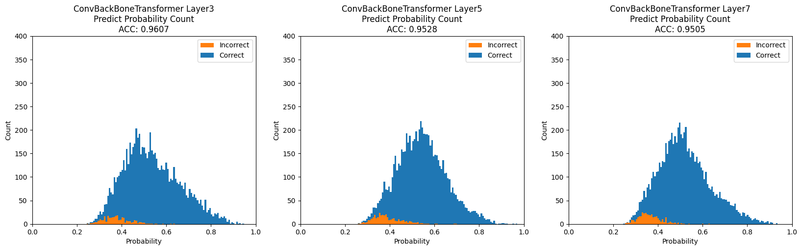
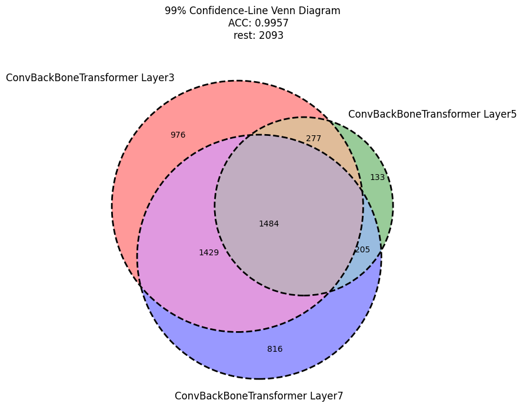
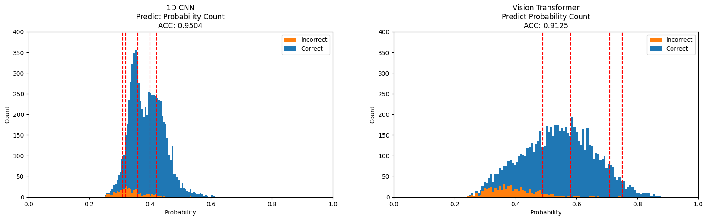

## 2024年度 卒業論文
# 深層学習を用いた人間行動識別における確度評価による階層化予測

鳥取大学工学部機械物理系学科  
物理工学コース  
B20T1070Y  
指導教員 小谷岳生 教授


# 0. 目次
[1. 緒言](#1-緒言)  
[1.1 研究背景](#11-研究背景)  
[1.2 研究目的](#12-研究目的)  
[2. 研究手法](#2-研究手法)  
[2.1 データの入出力](#21-データの入出力)  
[2.2 モデル](#22-モデル)  
[2.3 確度の算出方法](#23-確度の算出方法)  
[2.4 評価方法](#24-評価方法)  
[3. 結果と考察](#3-結果と考察)  
[3.1 結果](#31-結果)  
[3.2 考察](#32-考察)  
[4. 結言](#4-結言)  
[5. 参考文献](#5-参考文献)  
[6. 謝辞](#6-謝辞)  
[7. 付録](#7-付録)  
[7.1 使用したコード](#71-使用したコード)  
[7.2 実験の再現方法](#72-実験の再現方法)  
[7.3 モデルについて](#73-モデルについて)  
[8. ライセンス](#8ライセンス)

# 1. 緒言
## 1.1 研究背景

深層学習を用いた人間行動識別では、誤検知が重要な問題となっている。誤検知が発生すると、安全保障システムや健康モニタリングなどの分野で深刻な影響を及ぼす可能性がある。
たとえば、異常な行動を見逃してしてしまうことが適切な対応を難しくしシステムの信頼性を低下させる。

また、Transformerの応用研究として、特性を活かし行動認識での適用可能性を示す。
また、自然言語を対象として考案されたTransformerがどのように他分野で活用することができるのか、加速度データを用いた行動認識を対象として実例を提供する。


## 1.2 研究目的

本研究の目的は、深層学習の技術であるTransformerの応用研究として人間行動識別の分野で多クラス分類を行い、その予測結果に対して階層化した予測を行うことである。
本研究では、人間の行動識別におけるベンチマークのWISDMデータセットを使用した。
深層学習の手法であるTransformerを導入し、通常の多数決ではなく各予測に対して定量的に評価した確度を考慮したアンサンブル方法を適用する。
階層化予測は、異なる精度や信頼性の予測を段階的に行うことで、誤検知のリスクを軽減し高い精度での予測を行う。
6段階に階層化した予測を行うことで、部分的ではあるがテストデータの72％において99.6％というSOTAを大きく上回る高い精度を実現し、単なる多数決よりも高度な信頼性を持つモデルを構築することに成功した。

# 2. 研究手法
## 2.1 データの入出力

WISDM(Wireless Sensor Data Mining)データセットは2010年に携帯電話を用いて人の行動状態と加速度を取得し、集めたデータセットである。[2]

今回の目的変数とする6つの行動状態を表1に示す。


表1：WISDMデータセットの行動状態
| Activity   | Counts | Percentage |
|------------|--------|------------|
| Walking    | 10611  | 38.6%      |
| Jogging    | 8552   | 31.2%      |
| Upstairs   | 3069   | 11.2%      |
| Downstairs | 2511   | 9.14%      |
| Sitting    | 1499   | 5.46%      |
| Standing   | 1212   | 4.41%      |
| Total      | 27454  | 100%       |


また、入力データは時系列データであり、サンプリングレートは20Hzである。
また、1データあたり80サンプル存在することから、1データは約4秒である。
つまり、加速度計から取得した4秒間のデータから人間の行動を予測するタスクであると言い換えることができる。

また、加速度データはx,y,zの3軸を持っており、それぞれ図1に示す軸方向を持つ。


図1：WISDMデータセットの軸の取り方  
[2]-Figure 1: Axes of Motion Relative to Userから引用

各ラベルの入力データを可視化し、図2に示す。


図2：WISDMデータセットの入力データの可視化  
[2]-Figure 2: Acceleration Plots for the Six Activities (a-f)から引用

図1、2から推察できるそれぞれの行動状態についての特徴をまとめる。
値域について、-20 m/s²から20m/s²の範囲をとる。
これには重力を含んでいるため、常に鉛直方向に約9.8m/s²程度のバイアスが加わる。

また、SittingとStandingの2種類は静的であり、動的な他4種類の行動状態と大きく異なる。
SittingとStandingはｘｙｚ軸すべてについてコンスタントな値をとる。
また、SittingとStandingについても軸方向の取り方と重力の影響によりSitting状態ではｚ軸の数値が大きく、Standing状態ではｙ軸の数値が大きい。
他の4つについては、以下の特徴を持つ。
Walkingは0.5秒の周期でピークがあり、ｘ軸は他のｙｚ軸より常に小さい値をとっている。
Joggingは0.25秒の周期でピークが存在し、ｙ軸について負の値がWalkingより顕著である。
Downstairsでは0.5秒の周期であり、ｙ軸の加速度が小さい。
Upstairsではｙｚ軸に0.75秒の周期があり、足の進みが他の行動状態より遅い。

## 2.2 モデル

モデルには、Conv. BackBone Transformer を用いた。
Conv. BackBone Transformer は、Convolutional Neural Network (CNN) と Transformerのエンコーダー層を組み合わせたモデルである。

処理の流れとしては、

まず、データをTransformerに扱いやすい形に整えるために、Convolutional Neural Network（CNN）を使用して入力データから特徴を抽出する。
具体的には、データのチャンネル数を3チャンネルの入力から25チャンネルに増やす。
畳み込み層では活性化関数としてGERUを用い、カーネルサイズ1のフィルタで変換する。

次に、線形変換を各ベクトルごとに行い、80次元から1024次元にエンコードする。
また、多クラス分類を行うために入力データにCLSトークンを追加し、Position Embeddingとを行う。Position Embeddingとは、学習可能な重みを足し合わせる計算である。これによって、各要素の位置情報が考慮される。

その後、Transformer層にデータを送る。
Transformer層では、正規化（PreNormalization）や、Multi-Layer Perceptron（MLP）、Multi-Head Self-Attention（MSA）を使って、各要素同士の関連性を考慮する。
MSAでは、各要素の重要度を計算しそれに基づいて新たな表現を生成する。
これにより、CLSトークンに入力データが集約される。
また、Transformerブロックでは、各変換に残差接続と正規化が施される。
これにより、情報の損失を最小限に抑え学習の安定性が向上する。

最後に、CLSトークンをMLPに入力して多クラス分類を行う。
また、モデルのバリエーションとして、Transformer層の数 L を3、5、7としたモデルを作成した。


図3にConv. BackBone Transformerのアーキテクチャを示す。


図3：Conv. BackBone Transformer アーキテクチャ

処理の手順を数式で表現する。

Conv.BackBone Transformer  
loop four times  
    xi ← GERU(Conv1d Layer(xi))  
xi ← xi・E    
x=Concat(CLS, x1, x2, ... , xn)  
x ← x + Epos  
loop L times  
    x  ←  Normalization(x)  
    x  ←  MSA(x) + x  
    x  ←  Normalization(x)  
    x ← MLP(x) + x  
y=MLP(CLS)  

where  
    GELU(x)=xφ(x)  
　  φ(x) is cumulative distribution function  
    E=R^80×1024  
    Epos=R^25×1024  
    MSA(x)=Concat(head1(x), head2(x), ... , headn(n)) Woutput  
    headi=SelfAttention(x) Wi  
    SelfAttention(x)=Softmax(x・Wq x・Wk^T)・x・Wv  
    Softmax(xi)=exp(xi)/Σexp(xj)  

モデルの予測結果の確度を算出する。
モデルの出力は確率化されていない6次元のベクトルである。
確度の要請として、各要素の値域が0以上1以下で総和が1となるような変換を行う。
今回はMin-Max Scalingを行い値域が0以上1以下になるように変換した上で、その後総和が1となるように各要素を総和で割ることで確度を算出した。

処理の手順を以下に数式で表現する。

xi ← xi - min(x) / max(x) - min(x)  
xi ← xi / Σ xj


## 2.4 評価方法

また、モデルのバリエーションとして、Transformer層の数 L を3、5、7としたモデルを作成し、訓練データに70%の19217個、検証データに3%の824個、テストデータに27%の7413個のデータを用いた。
訓練データとテストデータは完全にランダムに分割し、テストデータと検証データは、ラベルの分布が等しくなるように分割した。

また、以下の指標を用いて、モデルの精度評価を行った。

- ACC
- RCL
- PRC
- F1-Score

ACCとはAccuracyつまり正答率であり、正しく予測できた割合を表す。
RCLとはRecallつまり再現性であり、正解データのうち、正しく予測できた割合を表す。
PRCとはPrecisionつまり特異性であり、予測のうち、正解データの割合を表す。
F1-Scoreは、RCLとPRCの調和平均で、トレードオフなRCLとPRCのバランスを表す。

TP (True Positive), TN (True Negative), FP (False Positive),  FN (False Negative)を用いて以下に定義を示す。

ACC=TP+TNTP+TN+FP+FN  
RCL=TPTP+FN  
PRC=TPTP+FP  
F1-Score=21PRC+1RCL  

# 3. 結果と考察

## 3.1 結果

3、5、7層のモデルのテストデータの予測結果の確度分布を図4に示す。


図4：Conv.BackBone Transformerの確度の分布

確度の小さい部分に誤検知が多く存在しており、確度が下がるごとに誤検知が増える。
閾値は図4に赤い点線で表現した。
閾値は検証データから点線の右側のみを精度評価した場合精度を計算し決定した。
閾値は左から順番に96％・97％・98％・99％・99.5％を表す。
この閾値グループを左からクラスF-Aと定義する。

重複した部分については、確度の高い閾値グループを採用し、それでも重複する場合には表現力が最も高い7層を優先するように設定した。


確度の閾値に基づいてクラスA-Fの六段階の階層化予測を行った結果の表を表2に示す。

表2：クラスA-Fの階層化予測
| CLASS | THRESHOLD |  ACC  |  RCL  |  PRC  |   F1   | SIZE |
|-------|-----------|-------|-------|-------|--------|------|
|   A   |   99.5%   | 99.6% | 98.8% | 99.1% | 98.9%  | 5444 |
|   B   |   99%     | 93.8% | 93.0% | 93.2% | 93.0%  | 1192 |
|   C   |   98%     | 80.0% | 83.1% | 81.3% | 82.0%  |  594 |
|   D   |   97%     | 64.7% | 44.6% | 40.7% | 42.3%  |  135 |
|   E   |   96%     | 47.4% | 35.6% | 34.5% | 33.8%  |   38 |
|   F   |   Rest    | 30.0% | 34.0% | 21.7% | 22.4%  |   10 |
|  A-F  |   Total   | 96.2% | 94.4% | 95.0% | 94.7%  | 7413 |


クラスAの予測について各モデルの予測したインデックスのベン図を図5に示す。


図5：クラスAにおける各モデルの予測ベン図


比較用として、同モデル群に多数決アンサンブル方法を行った結果を表3に示す。

| CLASS | THRESHOLD |  ACC  |  RCL  |  PRC  |   F1   | SIZE |
|-------|-----------|-------|-------|-------|--------|------|
|   A   |  Vote-3   | 98.6% | 97.4% | 98.0% | 97.7%  | 6923 |
|   B   |  Vote-2   | 66.6% | 59.3% | 54.2% | 56.3%  |  461 |
|   C   |  Vote-1   | 48.3% | 35.2% | 33.7% | 31.1%  |   29 |
|  A-C  |   Total   | 96.4% | 94.8% | 95.6% | 92.0%  | 7413 |


## 3.2. 考察

クラスAの予測について考察を行う。
図5より、クラスAは全テストデータの72％であり、3、5、7層において3つのモデルが予測した総数は3946、2099、4500個であり、異なる予測をしているのは671、123、1118個、すべてが同じ出力をしているのは1569個である
モデルごとに予測の差異が見られたのは、モデルがそれぞれ入力データに含まれるノイズを学習したからであると考える。

次に、多数決のアンサンブル学習の方法との比較を行う。
全体の精度としては、多数決のアンサンブルの方が精度が高い。これは全体の精度として考えると、確度に基づくアンサンブル方法は確度の最大値を取り出す操作とほぼ同じであり採用されない他データを捨てる為、1予測あたりの情報の取捨選択が激しいからである。
一方で、クラスAの精度は確度に基づくアンサンブル方法の方が高い。さらに、階層化の分割数も確度に基づくアンサンブル方法の方が多く分割ができている。また、複数のクラスをまとめて一つのクラスとする場合に提案するアンサンブル方法を用いることで任意の精度を担保しながらクラスを作成することができる。
以上の比較をまとめると、多数決と比較すると全体の精度としては劣るがクラスAでの精度や階層化する数や階層の精度の任意性は確度に基づくアンサンブル方法の方が高い。

また、クラスFの予測についてはACCが30％であったことについて、
入力データは静的なラベル2つと、動的なラベル4つに分割できる。
この大分類を行った上で静的な場合の正答率が50％、動的な場合の正答率を25％としてランダムに回答した場合の準ランダムな精度を考えると、
これに入力データが静：動＝1：9であることを考慮して期待値から準ランダムに回答した場合のACCを計算すると27.5%である。
つまり、クラスFの予測のACCが30％というのはランダムに予測したものとほとんど変わらない。これは入力データ自体の誤りやノイズが非常に大きい可能性であると考える。
クラスEについて同様の計算を行うと、ランダムに回答した場合のACCは25.7％であり、クラスEの予測のACCが33.8％であることからある程度優位な計算ができたと言える。

他論文との比較を行う。
WISDMデータセットにおけるSOTAはCNNとBiLSTMを組み合わせたモデル[4]で、精度は97.31%である。
また、Transformerの適用事例として最大の精度を誇るものは音声認識の分野からの応用モデルでTransformer層に畳み込み層を入れることで、CNNとTransformerを組み合わせたConformer[5]であり、精度は96%であった。
いずれも、本研究の96.16%を上回る精度である。
しかし、階層化予測を行うことによってテストデータの72％を占めるクラスAの予測についてはSOTAを上回る99.6%の精度で予測できている。
研究背景でも説明したが、予測を絞り高い精度での予測を行うことができることは誤検知を軽減するという観点から評価すると重要である。

# 4. 結言

今回の研究では、人間行動識別における確度評価による階層化予測を行い、その結果、全体の精度は96.16%であった。
しかし、階層化予測を行うことで部分的ではあるが、全テストデータの72％のクラスAの予測については99.6%の精度を達成した。これは、SOTAを上回る精度である。
今後の展望として、Class-Aでも誤ったデータに対して誤差の主な要因を検討することや、クラスの分割が粗すぎた為クラスAがコンフリクトし、多くの3、5層のモデルの予測データが切り捨てられていることを考慮し、閾値をもっと細かくすること、WISDMデータセット以外においても、有効であるかどうかを検証することことがある。


# 5. 参考文献

[1]AN IMAGE IS WORTH 16X16 WORDS: TRANSFORMERS FOR IMAGE RECOGNITION AT SCALE  
[2]Activity Recognition using Cell Phone Accelerometers   
[3]Boosting Inertial-Based Human Activity Recognition With Transformers  
[4]Inertial-Measurement-Unit-Based Novel Human Activity   Recognition Algorithm Using Conformer  
[5]Human Activity Recognition Based on Residual Network and BiLSTM  
[6]Human activity recognition based on time series analysis using U-Net   
[7]https://www.kaggle.com/code/paulopinheiro/human-activity-recognition-1d-cnn (2023/11/16閲覧)  
[8]深層学習 改訂第2版 (機械学習プロフェッショナルシリーズ) - 岡谷貫之


# 6. 謝辞

研究を進めるにあたり、懇切丁寧にご指導を頂いた鳥取大学工学部機械物理系学科の計算理工学研究室小谷岳生教授、同研究室の藤井一輝さんに深く感謝致します。

# 7. 付録
## 7.1 使用したコード

コードはすべてPythonの深層学習用ライブラリであるPytorchを用いて実装を行った。
ディレクトリ構成は以下の通りである。

<pre>
.
├── README.md：本ファイル
├── run.py：実験実行コード
├── setup.py：実験環境構築コード（実行不要）
├── requirements.txt：使用した外部ライブラリ
├── assets: README.mdに使用した画像
├── data：データセット
│   ├── WISDM_ar_latest.tar.gz
│   ├── WISDM_ar_v1.1.csv
│   ├── WISDM_ar_v1.1_raw.txt
│   ├── WISDM_ar_v1.1_raw_about.txt
│   ├── WISDM_ar_v1.1_trans_about.txt
│   ├── WISDM_ar_v1.1_transformed.arff
│   └── readme.txt
├── result：実験結果
├── lib：ローカルライブラリ
│   ├── __init__.py
│   ├── local_utils.py
│   ├── model.py
│   ├── postprocess.py
│   └── preprocess.py
├── main：実験メインコード
│   ├── cnn1d.py
│   ├── cnn1d_tf.py
│   ├── convbbt.py
│   ├── optuna_convbbt.py
│   ├── optuna_convtransformer.py
│   ├── optuna_vit1d.py
│   ├── transposition_convbbt.py
│   └── vit1d.py
└── notebook：実験結果の可視化
     ├── inputbased_analyze.ipynb
     ├── missdata_viz.ipynb
     ├── preprocess.ipynb
     └── statical_process.ipynb

</pre>

## 7.2 実験の再現方法

実行時には、--pathオプションに実験したいモデル名を指定する。
リポジトリに用意しているモデルを表4に示す。

表4：リポジトリに用意しているモデル
| モデル                    | 説明                                                        |
|-------------------------|---------------------------------------------------------------|
| convbbt                 | Conv. BackBone Transformer ※デフォルト                       |
| cnn1d                   | Convolutional Neural Network                                  |
| vit1d                   | Vision Transformer                                            |
| transposition_convbbt   | 入力データの転置を行った Conv. BackBone Transformer           |
| optuna_convbbt          | Optunaを用いてハイパラ最適化を行う Conv. BackBone Transformer |
| optuna_vit1d            | Optunaを用いてハイパラ最適化を行う Vision Transformer         |
| optuna_convtransformer  | 軽量化した Conv. BackBone Transformer                         |

使用例

```
$ python run.py --path convbbt --git push
```

初回実行時に限り以下のリンクよりデータをダウンロードすることに留意。

https://www.cis.fordham.edu/wisdm/includes/datasets/latest/WISDM_ar_latest.tar.gz

また、デフォルトではオフだが、--gitオプションにpushを渡すことで実験結果を即リモートにpushすることができる。
リモート先を自分のリポジトリに変更しGitHubのpush時の通知を有効にすることで実験結果が通知される。
Optunaを用いた実験を行う場合には非常に長い時間の実験となるため、このオプションを有効にすることを推奨する。

## 7.3 モデルについて

本研究では、Conv. BackBone Transformer を用いた。

しかし、他にもいくつかのモデルを用いて実験を行った。
以下にそのモデルについて説明する。

- CNN[6]
- Vision Transformer

CNNは4層の畳み込み層と1層の全結合層によって構成されており、Vision Transformerはパッチ化を行い、線形変換を施した後にTransformer層に入力を行う。
いずれも、Conv. BackBone Transformer と比較をすると確度評価による階層化予測の精度が低下する。

理由として、
- CNNは確度分布が一様で、多数決アルゴリズムによる階層化予測が困難
- ViTはモデル自体の精度が低い

ではないかと考える。

また、他モデルと比較したTransformerの優位性として、スケーラビリティがある。
Transformerでは、Transformer層を重ねることでモデルの表現力を調整することができる。
CNNやRNNでモデルの表現力を調整するためには、モデルの構造を大きく変更する必要がある。一方で、Transformerは層を調整することによりモデルの構造を大きく変更することなく、モデルの表現力を調整することができる。

CNNのモデル、ViTのモデルについて、図6に確度の分布を示す。
ViTについて、確度の分布はなだらかで、確度が低い部分に誤りが多く存在している。
CNNについて、急激に確度が低下している。
誤りの分布が一様になっておりうまく階層化予測ができないことがわかる。


図6：CNN、Vision Transformerのテストデータにおける確度の分布

## 7.4 モデルのハイパーパラメータの決定方法

モデルのハイパーパラメータの決定には、Optunaを用いた。
Optunaとは、ベイズ推定を用いたハイパーパラメータの最適化を行うPythonライブラリ。
Optunaを用いることで、グリッドサーチやランダムサーチよりも効率的にハイパーパラメータの最適化を行うことができる。
探索空間を定義し、目的関数を定義することで、ハイパーパラメータの最適化を行うことができる。
時間または回数を指定して探索を行うことができる。

Conv. BackBone Transformer についてのOptunaでの探索結果を表5に示す。


表5：OptunaでのConv. BackBone Transformerのハイパーパラメータ探索結果
| ハイパーパラメータ  | 説明                                | 値           |
|---------------------|-------------------------------------|--------------|
| Learning rate       | 学習率                              | 0.0001       |
| Betas               | 過去の勾配の指数移動平均の重み      | (0.9, 0.999) |
| Epsilon             | 分母がゼロになるのを防ぐ項          | 1e-08        |
| Weight decay        | 重みの減衰係数                      | 0            |
|                     |                                     |              |
| Hidden channels     | Transformerに入力するチャンネル数   | 25           |
| Hidden dimension    | Transformerに入力する次元数         | 1024         |
| Multi heads         | MSAの分割ヘッド数                   | 8            |
| MLP dimension       | MLPの隠れ層の次元                   | 1024         |
| Dropout             | TransformerブロックのDropoutの確率  | 0.01         |
| Embed Layer Dropout | MLPのDropoutの確率                  | 0.01         |
