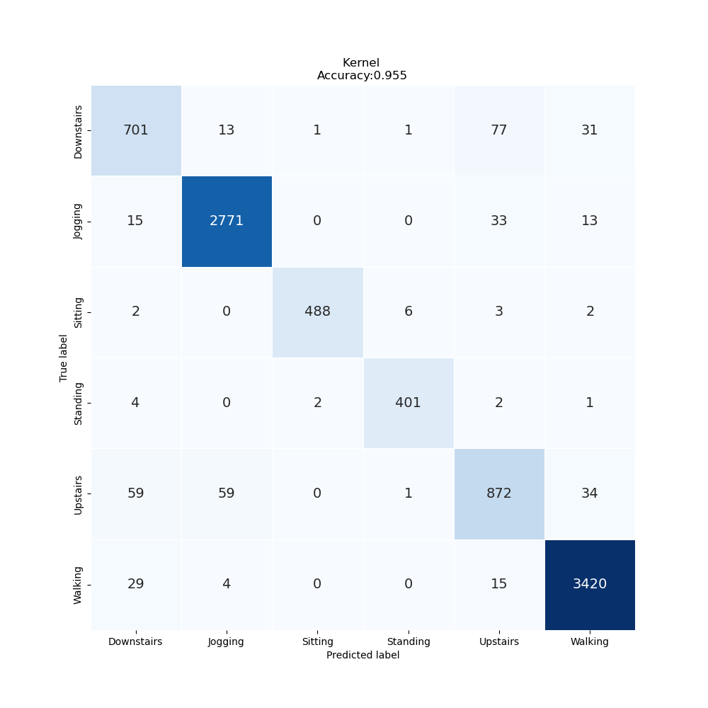

# 実験メモ

## 日付
2023-07-14 13:02:42.184493

## MODEL NAME
cnn1d_tf

## start_date
2023-07-14 13:02:42.184493

## end_date
2023-07-14 13:06:17.595194

## report
              precision    recall  f1-score   support

  Downstairs       0.87      0.85      0.86       824
     Jogging       0.97      0.98      0.98      2832
     Sitting       0.99      0.97      0.98       501
    Standing       0.98      0.98      0.98       410
    Upstairs       0.87      0.85      0.86      1025
     Walking       0.98      0.99      0.98      3468

    accuracy                           0.96      9060
   macro avg       0.94      0.94      0.94      9060
weighted avg       0.95      0.96      0.95      9060

## feature param
{'LABELS': ['Downstairs', 'Jogging', 'Sitting', 'Standing', 'Upstairs', 'Walking'], 'TIME_PERIODS': 80, 'STEP_DISTANCE': 40, 'N_FEATURES': 3, 'LABEL': 'ActivityEncoded', 'SEED': 314}

## model size
0.0 GB

## confusion_matrix

