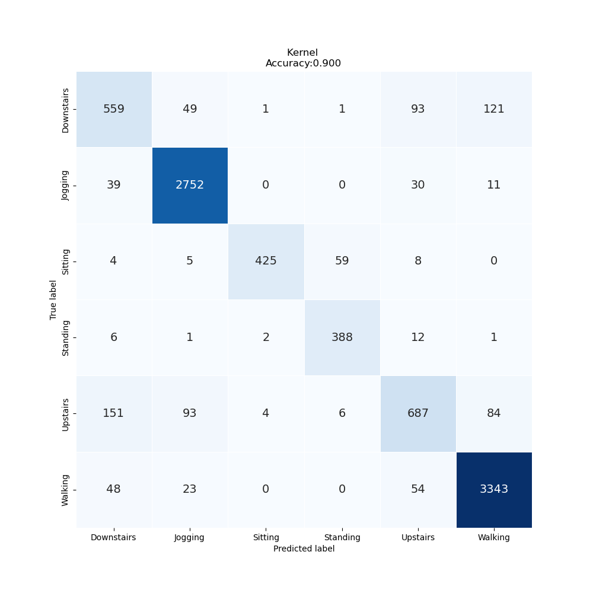

# Lab Notebook

## Model name
optuna_vit1d

## Start date
2023-07-14 15:08:08.274215

## End date
2023-07-15 00:29:36.540358

## Execution time
9 hours 21 minutes 28 seconds

## Report
| | precision | recall | f1-score | support |
| --- | --- | --- | --- |
|  |
| Downstairs | 0.69 | 0.68 | 0.69 | 824 |
| Jogging | 0.94 | 0.97 | 0.96 | 2832 |
| Sitting | 0.98 | 0.85 | 0.91 | 501 |
| Standing | 0.85 | 0.95 | 0.90 | 410 |
| Upstairs | 0.78 | 0.67 | 0.72 | 1025 |
| Walking | 0.94 | 0.96 | 0.95 | 3468 |
|  |
| accuracy | 0.90 | 9060 |
| macro | avg | 0.86 | 0.85 | 0.85 | 9060 |
| weighted | avg | 0.90 | 0.90 | 0.90 | 9060 |

## Optuna search space
- patch_size: [1, 2, 5, 8, 10, 16, 40]
- dim: [32, 64, 128, 256, 512]
- depth: [3, 5, 6, 8]
- heads: [3, 5, 6, 8, 10]
- mlp_dim: [256, 512, 1024, 2048]
- dropout: [0.01, 0.1, 0.25, 0.5, 0.8]
- emb_dropout: [0.01, 0.1, 0.25, 0.5, 0.8]
- batch_size: [32, 64, 128, 256, 512]

## Feature param
- LABELS: Downstairs, Jogging, Sitting, Standing, Upstairs, Walking
- TIME_PERIODS: 80
- STEP_DISTANCE: 40
- N_FEATURES: 3
- LABEL: ActivityEncoded
- SEED: 314

## Model size
Size: 6373621    B

## Confusion_matrix

