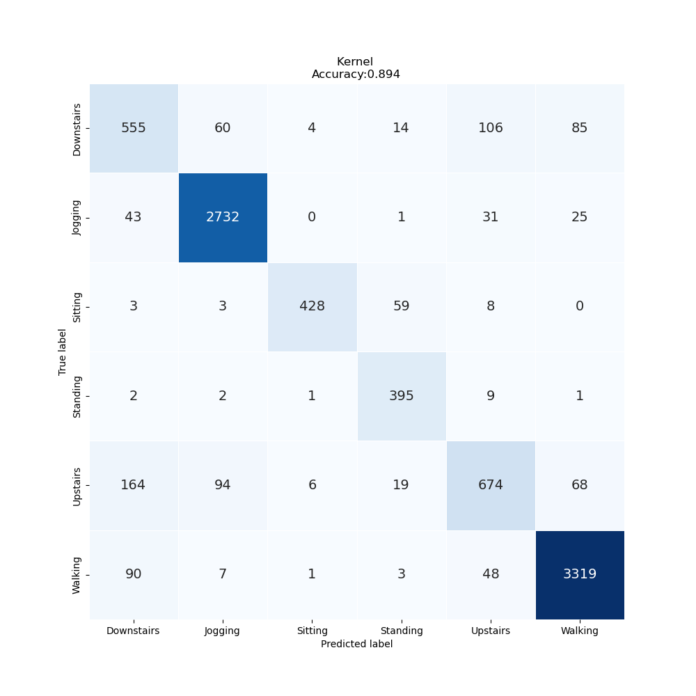

# Lab Notebook

## Model name
vit1d

## Start date
2023-07-14 15:01:19.924128

## End date
2023-07-14 15:03:35.964468

## Execution time
0 hours 2 minutes 16 seconds

## Report
| precision | recall | f1-score | support |
| --- | --- | --- | --- |
|  |
| Downstairs | 0.65 | 0.67 | 0.66 | 824 |
| Jogging | 0.94 | 0.96 | 0.95 | 2832 |
| Sitting | 0.97 | 0.85 | 0.91 | 501 |
| Standing | 0.80 | 0.96 | 0.88 | 410 |
| Upstairs | 0.77 | 0.66 | 0.71 | 1025 |
| Walking | 0.95 | 0.96 | 0.95 | 3468 |
|  |
| accuracy | 0.89 | 9060 |
| macro | avg | 0.85 | 0.85 | 0.84 | 9060 |
| weighted | avg | 0.89 | 0.89 | 0.89 | 9060 |

## Optuna search space
None

## Feature param
- LABELS: Downstairs, Jogging, Sitting, Standing, Upstairs, Walking
- TIME_PERIODS: 80
- STEP_DISTANCE: 40
- N_FEATURES: 3
- LABEL: ActivityEncoded
- SEED: 314

## Model size
Size: 151409920  B

## Confusion_matrix

