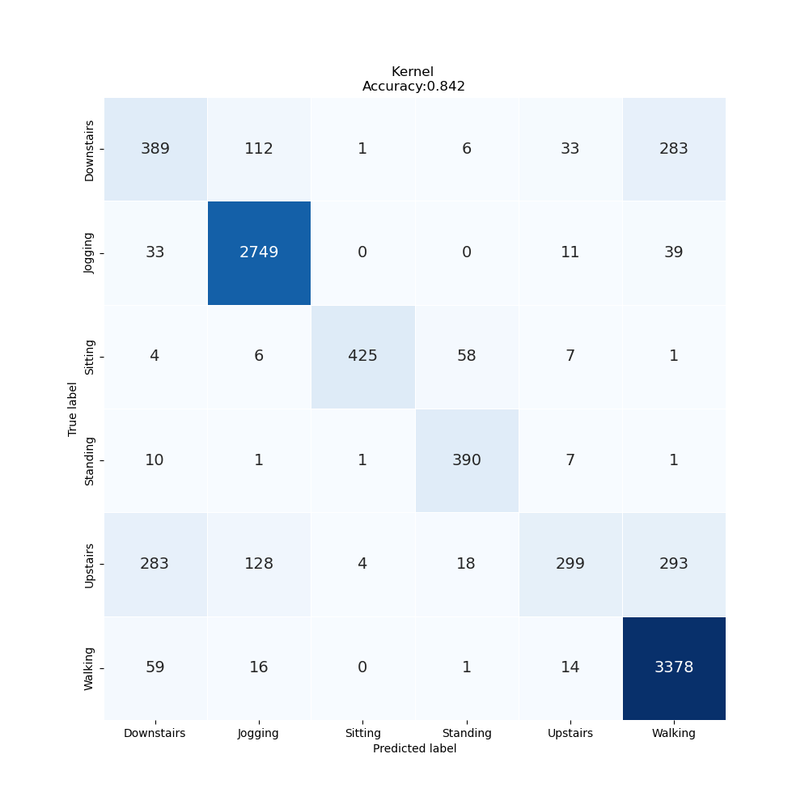

# Lab Notebook

## Model name
vit1d

## Start date
2023-07-16 19:53:23.581566

## End date
2023-07-16 19:54:13.942247

## Execution time
0 hours 0 minutes 50 seconds

## Report
| | precision | recall | f1-score | support |
| --- | --- | --- | --- | --- |
|  |
| Downstairs | 0.50 | 0.47 | 0.49 | 824 |
| Jogging | 0.91 | 0.97 | 0.94 | 2832 |
| Sitting | 0.99 | 0.85 | 0.91 | 501 |
| Standing | 0.82 | 0.95 | 0.88 | 410 |
| Upstairs | 0.81 | 0.29 | 0.43 | 1025 |
| Walking | 0.85 | 0.97 | 0.91 | 3468 |
|  |
|  accuracy || | 0.84 | 9060 |
| macro | avg | 0.81 | 0.75 | 0.76 | 9060 |
| weighted | avg | 0.84 | 0.84 | 0.82 | 9060 |

## Optuna search space
None

## Feature param
- LABELS: Downstairs, Jogging, Sitting, Standing, Upstairs, Walking
- TIME_PERIODS: 80
- STEP_DISTANCE: 40
- N_FEATURES: 3
- LABEL: ActivityEncoded
- SEED: 314
- MAX_EPOCH: 200
- BATCH_SIZE: 128

## Model size
Size: 151409920  B

## Confusion_matrix

