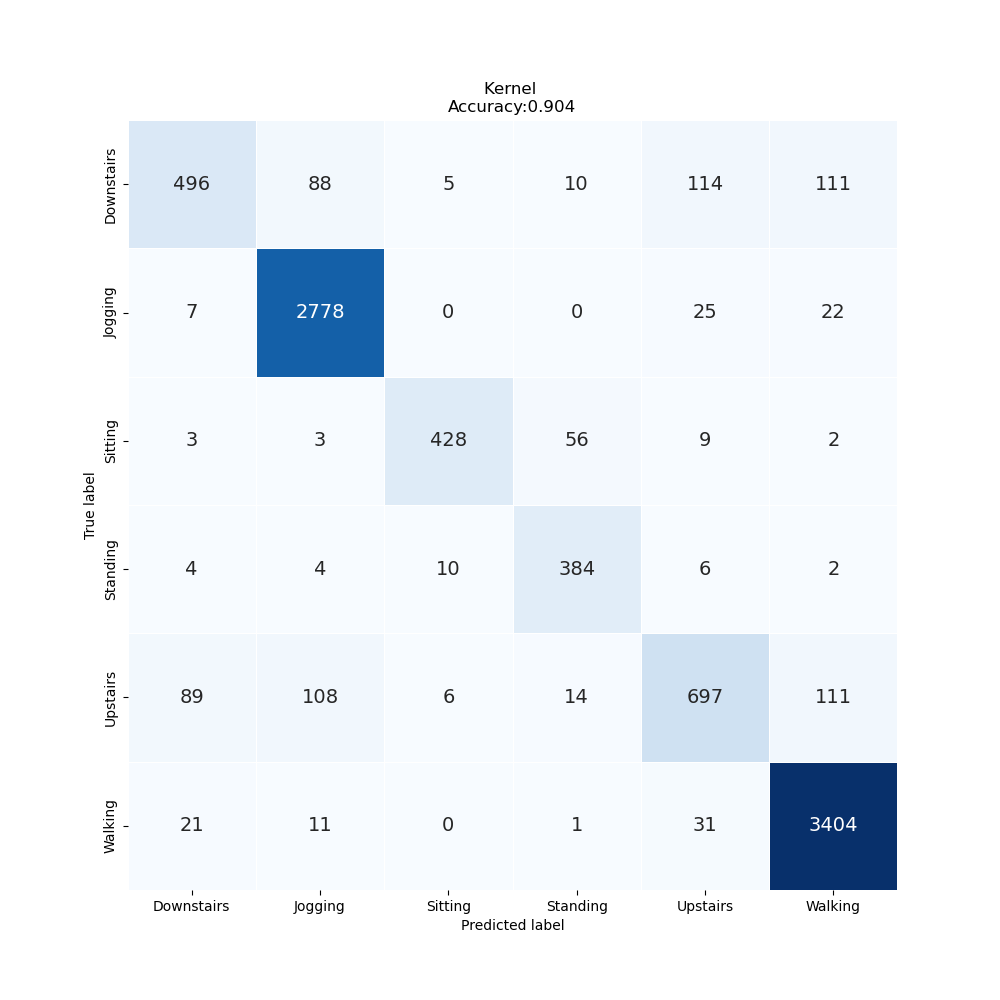
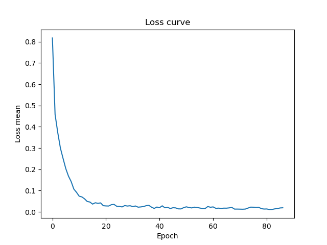

# Lab Notebook

## Model name
vit1d

## Start date
2023-07-17 15:08:04.618908

## End date
2023-07-17 15:19:04.755884

## Execution time
0 hours 11 minutes 0 seconds

## Report
| | precision | recall | f1-score | support |
| --- | --- | --- | --- | --- |
|  |
| Downstairs | 0.80 | 0.60 | 0.69 | 824 |
| Jogging | 0.93 | 0.98 | 0.95 | 2832 |
| Sitting | 0.95 | 0.85 | 0.90 | 501 |
| Standing | 0.83 | 0.94 | 0.88 | 410 |
| Upstairs | 0.79 | 0.68 | 0.73 | 1025 |
| Walking | 0.93 | 0.98 | 0.96 | 3468 |
|  |
|  accuracy || | 0.90 | 9060 |
| macro | avg | 0.87 | 0.84 | 0.85 | 9060 |
| weighted | avg | 0.90 | 0.90 | 0.90 | 9060 |

## Optuna search space
None

## Feature param
- LABELS: Downstairs, Jogging, Sitting, Standing, Upstairs, Walking
- TIME_PERIODS: 80
- STEP_DISTANCE: 40
- N_FEATURES: 3
- LABEL: ActivityEncoded
- SEED: 314
- MAX_EPOCH: 500
- BATCH_SIZE: 128

## Model size
Size: 151409920  B

## Confusion_matrix

## Loss curve

