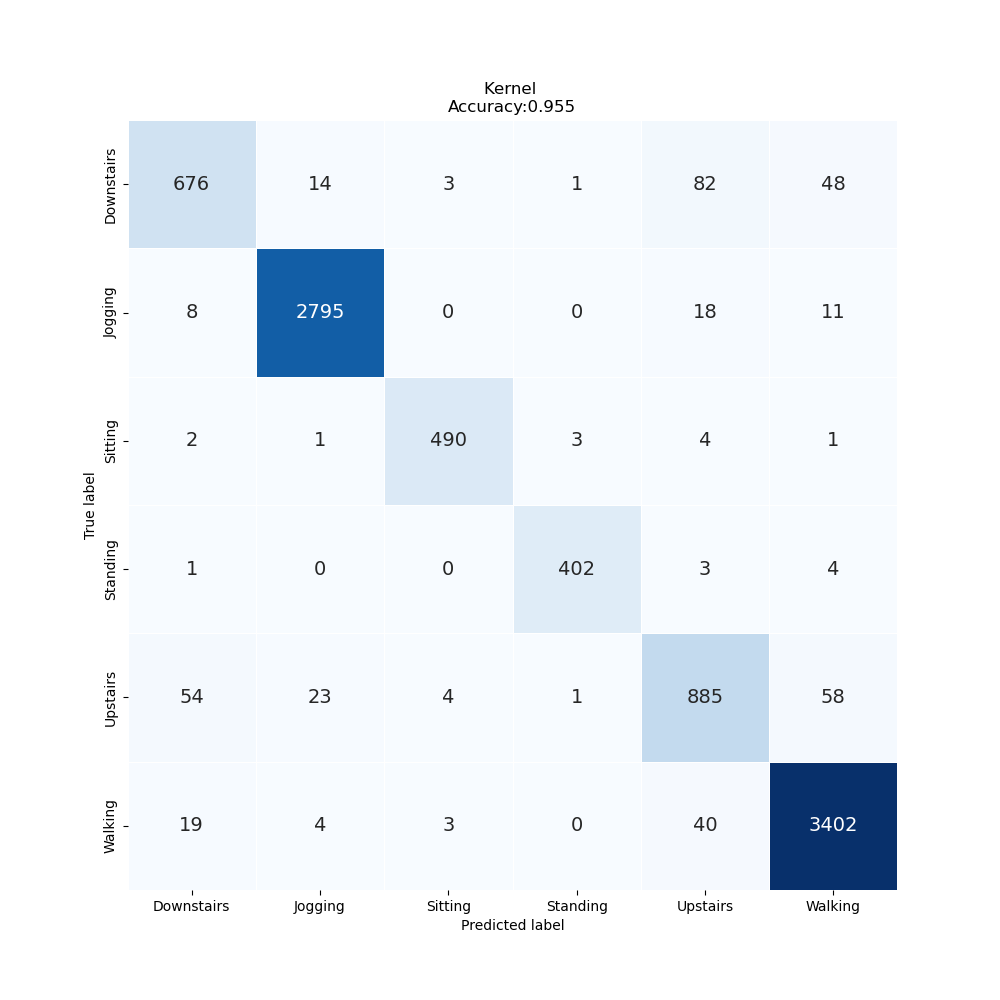
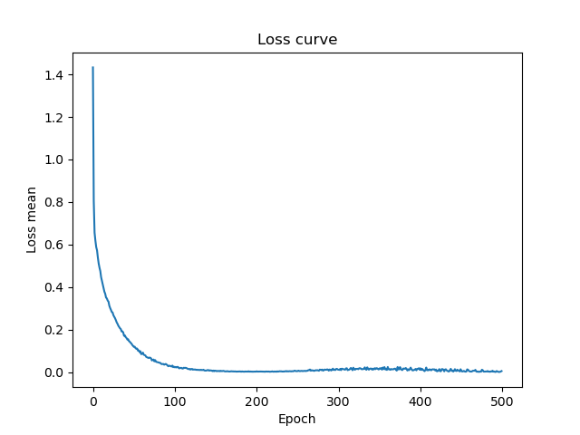

# Lab Notebook

## Model name
convbbt

## Start date
2023-07-18 15:31:03.781029

## End date
2023-07-18 16:00:53.472366

## Execution time
0 hours 29 minutes 49 seconds

## Report
| | precision | recall | f1-score | support |
| --- | --- | --- | --- | --- |
|  |
| Downstairs | 0.89 | 0.82 | 0.85 | 824 |
| Jogging | 0.99 | 0.99 | 0.99 | 2832 |
| Sitting | 0.98 | 0.98 | 0.98 | 501 |
| Standing | 0.99 | 0.98 | 0.98 | 410 |
| Upstairs | 0.86 | 0.86 | 0.86 | 1025 |
| Walking | 0.97 | 0.98 | 0.97 | 3468 |
|  |
|  accuracy || | 0.95 | 9060 |
| macro | avg | 0.94 | 0.94 | 0.94 | 9060 |
| weighted | avg | 0.95 | 0.95 | 0.95 | 9060 |

## Optuna search space
None

## Feature param
- LABELS: Downstairs, Jogging, Sitting, Standing, Upstairs, Walking
- TIME PERIODS: 80
- STEP DISTANCE: 40
- N FEATURES: 3
- LABEL: ActivityEncoded
- SEED: 314
- MAX EPOCH: 500
- BATCH SIZE: 128
- REF SIZE: 5

## Adam params
- lr: 0.0001
- betas': (0.9, 0.999), 'eps': 1e-08, 'weight_decay': 0, 'amsgrad': False}
##  CosineAnnealingLRScheduler params
 {'T_max': 200, 'eta_min': 0, 'last_epoch': -1, 'verbose': False}
## Model params
 {'hidden_ch': 15, 'num_classes': 6, 'input_dim': 80, 'channels': 3, 'hidden_dim': 128, 'depth': 5, 'heads': 8, 'mlp_dim': 1024, 'dropout': 0.01, 'emb_dropout': 0.01}

## Model size
Size: 10612929   B

## Confusion_matrix

## Loss curve

