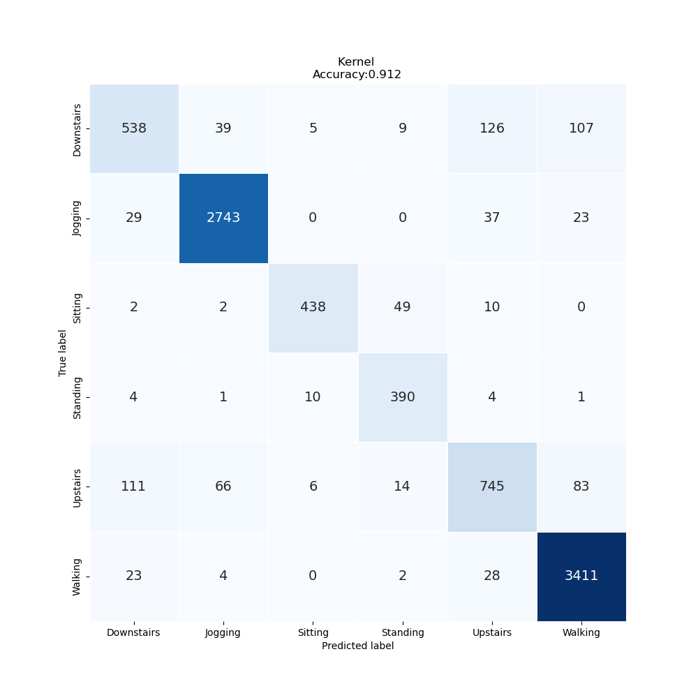
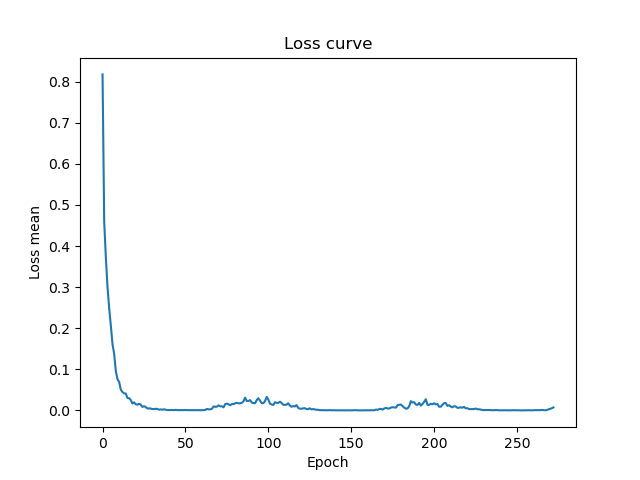

# Lab Notebook

## Model name
vit1d

## Start date
2023-07-18 14:56:55.858141

## End date
2023-07-18 15:30:57.720952

## Execution time
0 hours 34 minutes 1 seconds

## Report
| | precision | recall | f1-score | support |
| --- | --- | --- | --- | --- |
|  |
| Downstairs | 0.76 | 0.65 | 0.70 | 824 |
| Jogging | 0.96 | 0.97 | 0.96 | 2832 |
| Sitting | 0.95 | 0.87 | 0.91 | 501 |
| Standing | 0.84 | 0.95 | 0.89 | 410 |
| Upstairs | 0.78 | 0.73 | 0.75 | 1025 |
| Walking | 0.94 | 0.98 | 0.96 | 3468 |
|  |
|  accuracy || | 0.91 | 9060 |
| macro | avg | 0.87 | 0.86 | 0.86 | 9060 |
| weighted | avg | 0.91 | 0.91 | 0.91 | 9060 |

## Optuna search space
None

## Adam param
- lr: 0.0001
- betas: (0.9, 0.999)
- eps: 1e-08
- weight_decay: 0
- amsgrad: False

## CosineAnnealingLRScheduler param
- T_max: 50
- eta_min: 0
- last_epoch: -1
- verbose: False

## Model param
- seq_len: 80
- patch_size: 5
- num_classes: 6
- dim: 1024
- depth: 6
- heads: 8
- mlp_dim: 2048
- dropout: 0.1
- emb_dropout: 0.1

## Feature param
- LABELS: Downstairs, Jogging, Sitting, Standing, Upstairs, Walking
- TIME PERIODS: 80
- STEP DISTANCE: 40
- N FEATURES: 3
- LABEL: ActivityEncoded
- SEED: 314
- MAX EPOCH: 500
- BATCH SIZE: 128
- REF SIZE: 5

## Model size
Size: 151409920  B

## Confusion_matrix

## Loss curve

