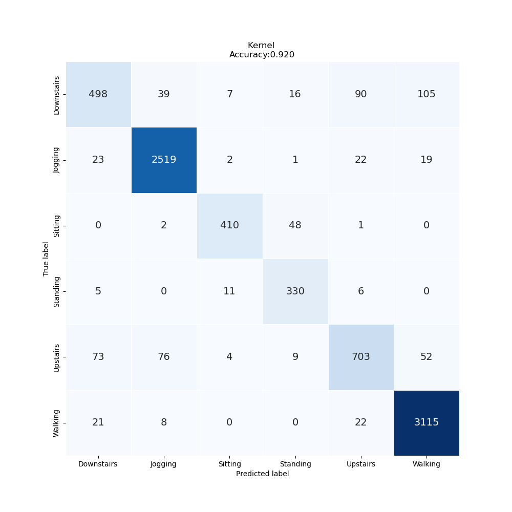
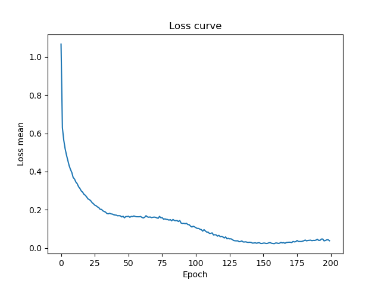

# Lab Notebook

## Model name
optuna_vit1d

## Start date
2023-07-28 08:04:29.351062

## End date
2023-07-28 08:18:00.147941

## Execution time
0 hours 13 minutes 30 seconds

## Report
| | precision | recall | f1-score | support |
| --- | --- | --- | --- | --- |
|  |
| Downstairs | 0.80 | 0.66 | 0.72 | 755 |
| Jogging | 0.95 | 0.97 | 0.96 | 2586 |
| Sitting | 0.94 | 0.89 | 0.92 | 461 |
| Standing | 0.82 | 0.94 | 0.87 | 352 |
| Upstairs | 0.83 | 0.77 | 0.80 | 917 |
| Walking | 0.95 | 0.98 | 0.96 | 3166 |
|  |
|  accuracy || | 0.92 | 8237 |
| macro | avg | 0.88 | 0.87 | 0.87 | 8237 |
| weighted | avg | 0.92 | 0.92 | 0.92 | 8237 |

## Optuna search space
None

## Feature param
- LABELS: Downstairs, Jogging, Sitting, Standing, Upstairs, Walking
- TIME_PERIODS: 80
- STEP_DISTANCE: 40
- N_FEATURES: 3
- LABEL: ActivityEncoded
- SEED: 314
- search_space: {'lr': [1e-06, 1e-05, 0.0001, 0.001], 'beta1': [0.9, 0.95, 0.99, 0.999], 'beta2': [0.9, 0.95, 0.99, 0.999], 'eps': [1e-09, 1e-08, 1e-07, 1e-06], 'T_max': [50, 100, 150, 200], 'eta_min': [0, 1e-08, 1e-07, 1e-06, 1e-05], 'patch_size': [1, 2, 4, 5, 8, 16], 'dim': [64, 128, 256, 512], 'depth': [3, 6, 9, 12, 15], 'heads': [5, 8, 10, 12, 16, 20, 24], 'mlp_dim': [256, 512, 1024, 2048], 'dropout': [0.0, 0.1, 0.2, 0.3, 0.4, 0.5], 'emb_dropout': [0.0, 0.1, 0.2, 0.3, 0.4, 0.5]}
- MAX_EPOCH: 200
- BATCH_SIZE: 128
- TIMEOUT_HOURS: 10

## Model size
Size: 44269247   B

## Confusion_matrix

## Loss curve

## Hyper parameter plots
None
