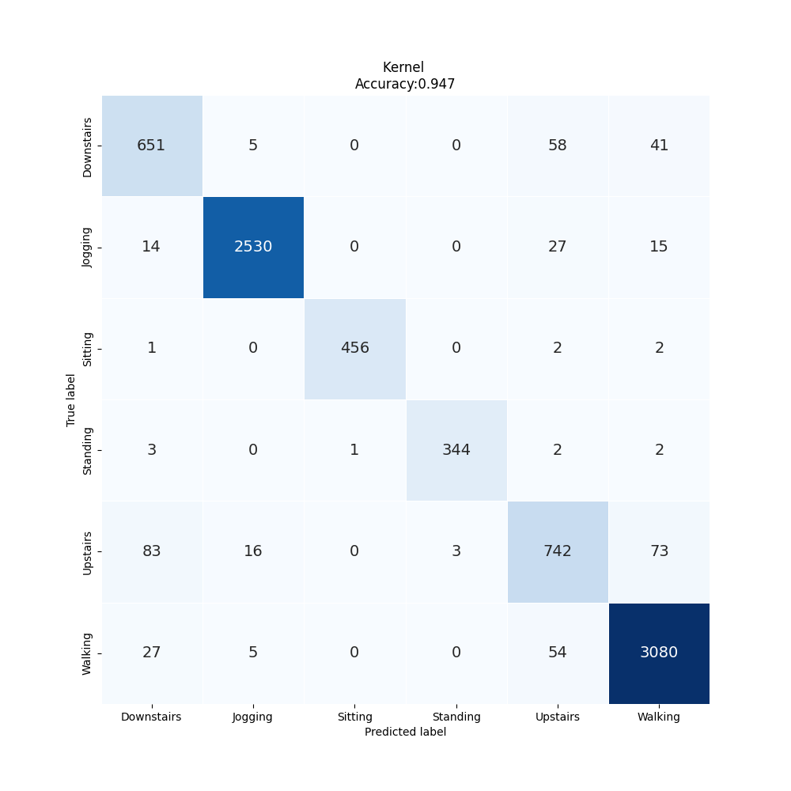
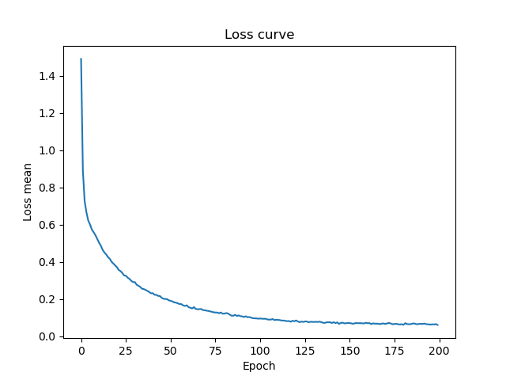

# Lab Notebook

## Model name
optuna_convbbt

## Start date
2023-07-28 07:53:28.836218

## End date
2023-07-28 08:03:39.407744

## Execution time
0 hours 10 minutes 10 seconds

## Report
| | precision | recall | f1-score | support |
| --- | --- | --- | --- | --- |
|  |
| Downstairs | 0.84 | 0.86 | 0.85 | 755 |
| Jogging | 0.99 | 0.98 | 0.98 | 2586 |
| Sitting | 1.00 | 0.99 | 0.99 | 461 |
| Standing | 0.99 | 0.98 | 0.98 | 352 |
| Upstairs | 0.84 | 0.81 | 0.82 | 917 |
| Walking | 0.96 | 0.97 | 0.97 | 3166 |
|  |
|  accuracy || | 0.95 | 8237 |
| macro | avg | 0.94 | 0.93 | 0.93 | 8237 |
| weighted | avg | 0.95 | 0.95 | 0.95 | 8237 |

## Optuna search space
None

## Feature param
- LABELS: Downstairs, Jogging, Sitting, Standing, Upstairs, Walking
- TIME_PERIODS: 80
- STEP_DISTANCE: 40
- N_FEATURES: 3
- LABEL: ActivityEncoded
- SEED: 314
- search_space: {'lr': [1e-06, 1e-05, 0.0001, 0.001], 'beta1': [0.9, 0.95, 0.99, 0.999], 'beta2': [0.9, 0.95, 0.99, 0.999], 'eps': [1e-09, 1e-08, 1e-07, 1e-06], 'T_max': [50, 100, 150, 200], 'eta_min': [0, 1e-08, 1e-07, 1e-06, 1e-05], 'hidden_ch': [3, 5, 7, 8, 10, 15], 'depth': [3, 5, 6, 8], 'heads': [3, 5, 6, 8, 10], 'hidden_dim': [64, 128, 256, 512, 1024], 'mlp_dim': [256, 512, 1024, 2048], 'dropout': [0.01, 0.1, 0.25, 0.5, 0.8], 'emb_dropout': [0.01, 0.1, 0.25, 0.5, 0.8]}
- TIMEOUT_HOURS: 10

## Model size
Size: 7480209    B

## Confusion_matrix

## Loss curve

## Hyper parameter plots
None
