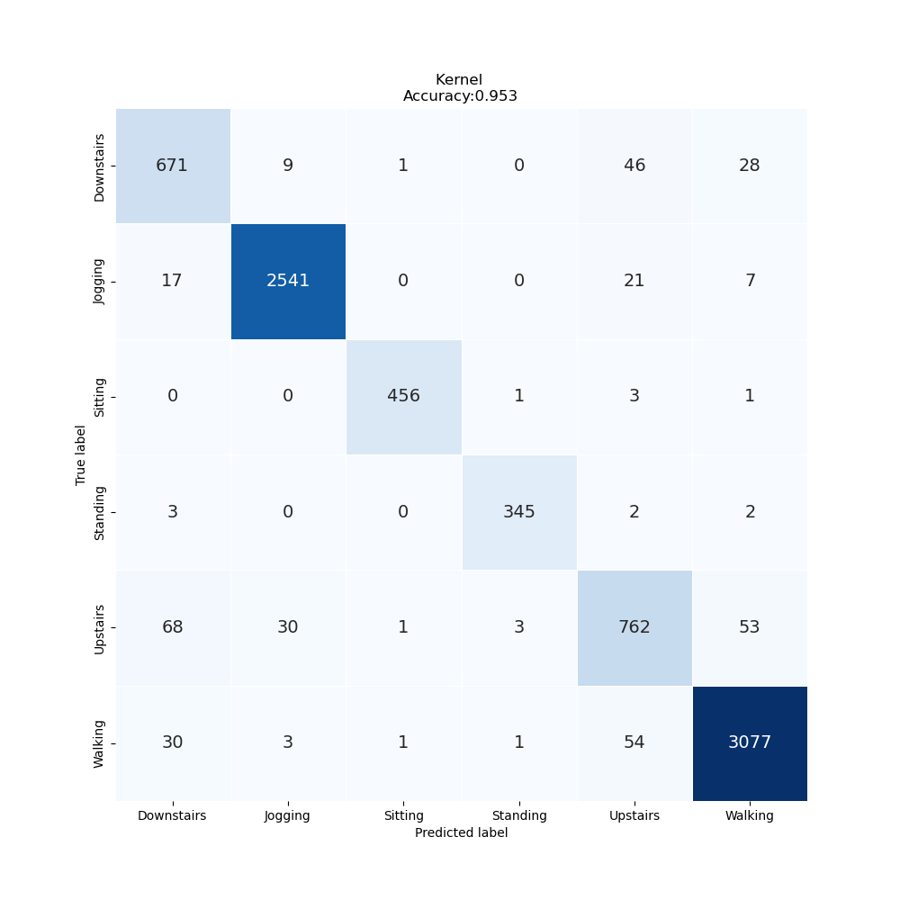
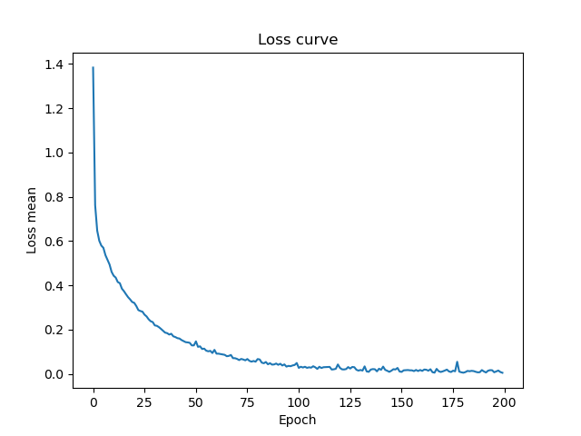

# Lab Notebook

## Model name
convbbt

## Start date
2023-09-11 14:50:20.717600

## End date
2023-09-11 14:59:34.451661

## Execution time
0 hours 9 minutes 13 seconds

## Report
| | precision | recall | f1-score | support |
| --- | --- | --- | --- | --- |
|  |
| Downstairs | 0.85 | 0.89 | 0.87 | 755 |
| Jogging | 0.98 | 0.98 | 0.98 | 2586 |
| Sitting | 0.99 | 0.99 | 0.99 | 461 |
| Standing | 0.99 | 0.98 | 0.98 | 352 |
| Upstairs | 0.86 | 0.83 | 0.84 | 917 |
| Walking | 0.97 | 0.97 | 0.97 | 3166 |
|  |
|  accuracy || | 0.95 | 8237 |
| macro | avg | 0.94 | 0.94 | 0.94 | 8237 |
| weighted | avg | 0.95 | 0.95 | 0.95 | 8237 |

## Optuna search space
None

## Feature param
- LABELS: Downstairs, Jogging, Sitting, Standing, Upstairs, Walking
- TIME_PERIODS: 80
- STEP_DISTANCE: 40
- N_FEATURES: 3
- LABEL: ActivityEncoded
- SEED: 314
- MAX_EPOCH: 200
- BATCH_SIZE: 128
- REF_SIZE: 5
- Adam_params: {'lr': 0.0001, 'betas': (0.9, 0.999), 'eps': 1e-08, 'weight_decay': 0, 'amsgrad': False}
- CosineAnnealingLRScheduler_params: {'T_max': 150, 'eta_min': 1e-05, 'last_epoch': -1, 'verbose': False}
- Model_params: {'num_classes': 6, 'input_dim': 80, 'channels': 3, 'hidden_ch': 15, 'hidden_dim': 128, 'depth': 5, 'heads': 8, 'mlp_dim': 1024, 'dropout': 0.01, 'emb_dropout': 0.01}

## Model size
Size: 10601155   B

## Confusion_matrix

## Loss curve

## optuna search plots
None
