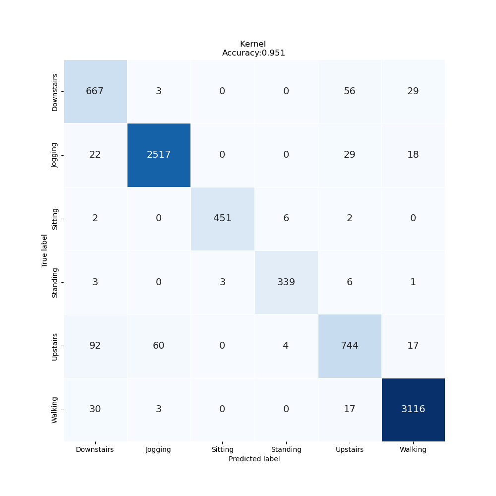

# Lab Notebook

## Model name
cnn1d_tf

## Start date
2023-09-21 17:15:28.528837

## End date
2023-09-21 17:19:07.283883

## Execution time
0 hours 3 minutes 38 seconds

## Report
| | precision | recall | f1-score | support |
| --- | --- | --- | --- | --- |
|  |
| Downstairs | 0.82 | 0.88 | 0.85 | 755 |
| Jogging | 0.97 | 0.97 | 0.97 | 2586 |
| Sitting | 0.99 | 0.98 | 0.99 | 461 |
| Standing | 0.97 | 0.96 | 0.97 | 352 |
| Upstairs | 0.87 | 0.81 | 0.84 | 917 |
| Walking | 0.98 | 0.98 | 0.98 | 3166 |
|  |
|  accuracy || | 0.95 | 8237 |
| macro | avg | 0.93 | 0.93 | 0.93 | 8237 |
| weighted | avg | 0.95 | 0.95 | 0.95 | 8237 |

## Optuna search space
None

## Feature param
- LABELS: Downstairs, Jogging, Sitting, Standing, Upstairs, Walking
- TIME_PERIODS: 80
- STEP_DISTANCE: 40
- N_FEATURES: 3
- LABEL: ActivityEncoded
- SEED: 314

## Model size
Size: 2807850    B

## Confusion_matrix

## Loss curve

## optuna search plots
None
