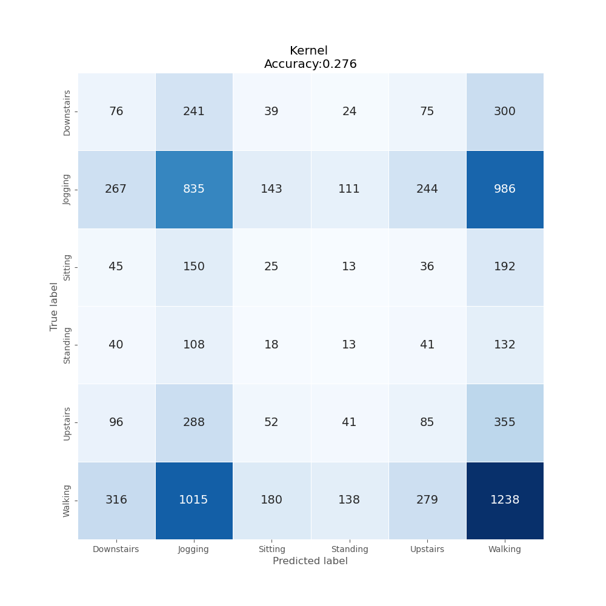
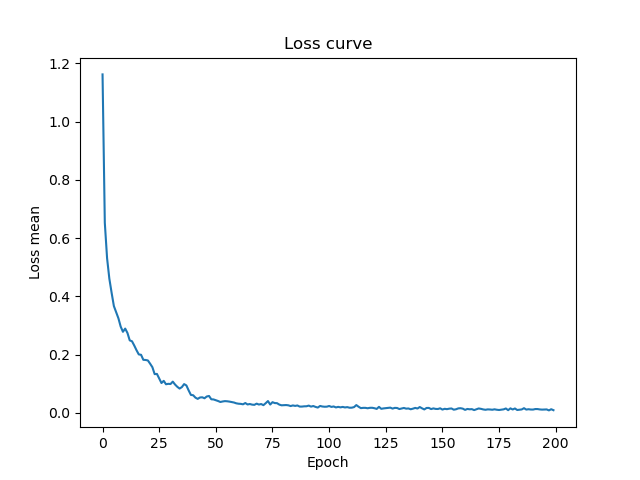
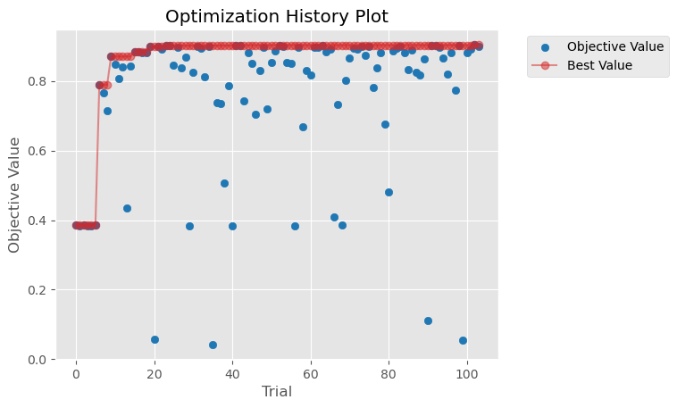
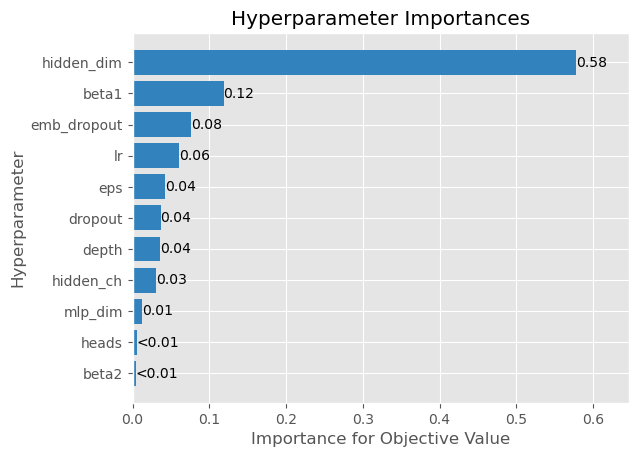

# Lab Notebook

## Model name
optuna_transposition_convbbt

## Start date
2023-09-26 13:46:19.205260

## End date
2023-09-27 14:01:31.854904

## Execution time
24 hours 15 minutes 12 seconds

## Report
| | precision | recall | f1-score | support |
| --- | --- | --- | --- | --- |
|  |
| Downstairs | 0.09 | 0.10 | 0.10 | 755 |
| Jogging | 0.32 | 0.32 | 0.32 | 2586 |
| Sitting | 0.05 | 0.05 | 0.05 | 461 |
| Standing | 0.04 | 0.04 | 0.04 | 352 |
| Upstairs | 0.11 | 0.09 | 0.10 | 917 |
| Walking | 0.39 | 0.39 | 0.39 | 3166 |
|  |
|  accuracy || | 0.28 | 8237 |
| macro | avg | 0.17 | 0.17 | 0.17 | 8237 |
| weighted | avg | 0.27 | 0.28 | 0.27 | 8237 |

## Optuna search space
- lr: [1e-06, 1e-05, 0.0001, 0.001]
- beta1: [0.9, 0.95, 0.99, 0.999]
- beta2: [0.9, 0.95, 0.99, 0.999]
- eps: [1e-09, 1e-08, 1e-07, 1e-06]
- hidden_ch: [10, 20, 30, 35, 40, 45, 50, 55, 60, 65, 70, 80, 90, 100]
- hidden_dim: [1, 3, 4, 8, 12, 16, 20, 32, 64, 128]
- depth: [1, 3, 5, 6, 8]
- heads: [1, 3, 5, 6, 8, 10]
- mlp_dim: [256, 512, 1024, 2048]
- dropout: [0.01, 0.1, 0.25, 0.5, 0.8]
- emb_dropout: [0.01, 0.1, 0.25, 0.5, 0.8]

## Feature param
- LABELS: Downstairs, Jogging, Sitting, Standing, Upstairs, Walking
- TIME_PERIODS: 80
- STEP_DISTANCE: 40
- N_FEATURES: 3
- LABEL: ActivityEncoded
- SEED: 314
- TIMEOUT_HOURS: 24

## Model size
Size: 570911     B

## Confusion_matrix

## Loss curve

## optuna search plots

