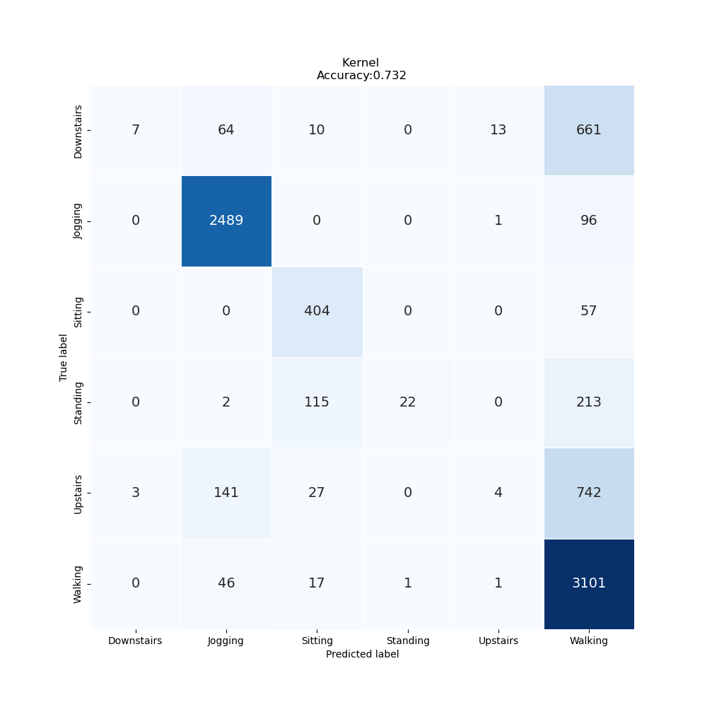

# Lab Notebook

## Model name
cnn1d

## Start date
2023-10-19 12:54:40.666919

## End date
2023-10-19 13:04:52.977515

## Execution time
0 hours 10 minutes 12 seconds

## Report
| | precision | recall | f1-score | support |
| --- | --- | --- | --- | --- |
|  |
| Downstairs | 0.49 | 0.03 | 0.06 | 755 |
| Jogging | 0.97 | 0.92 | 0.95 | 2586 |
| Sitting | 0.71 | 0.96 | 0.81 | 461 |
| Standing | 0.83 | 0.57 | 0.67 | 352 |
| Upstairs | 0.40 | 0.41 | 0.41 | 917 |
| Walking | 0.79 | 0.97 | 0.87 | 3166 |
|  |
|  accuracy || | 0.79 | 8237 |
| macro | avg | 0.70 | 0.64 | 0.63 | 8237 |
| weighted | avg | 0.77 | 0.79 | 0.76 | 8237 |

## Optuna search space
None

## Feature param
- LABELS: Downstairs, Jogging, Sitting, Standing, Upstairs, Walking
- TIME_PERIODS: 80
- STEP_DISTANCE: 40
- N_FEATURES: 3
- LABEL: ActivityEncoded
- SEED: 314

## Model size
Size: 1388975    B

## Confusion_matrix

## Loss curve

## optuna search plots
None
