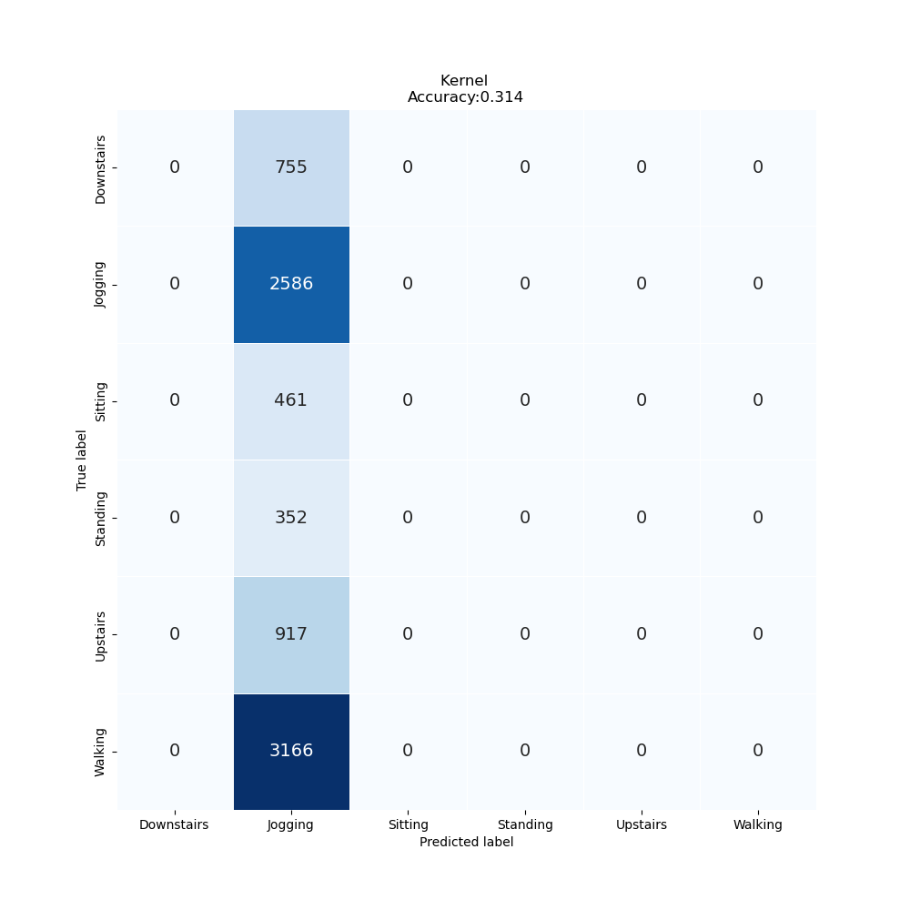

# Lab Notebook

## Model name
cnn1d

## Start date
2023-10-19 12:21:20.896119

## End date
2023-10-19 12:31:18.979705

## Execution time
0 hours 9 minutes 58 seconds

## Report
| | precision | recall | f1-score | support |
| --- | --- | --- | --- | --- |
|  |
| Downstairs | 0.00 | 0.00 | 0.00 | 755 |
| Jogging | 0.31 | 1.00 | 0.48 | 2586 |
| Sitting | 0.00 | 0.00 | 0.00 | 461 |
| Standing | 0.00 | 0.00 | 0.00 | 352 |
| Upstairs | 0.00 | 0.00 | 0.00 | 917 |
| Walking | 0.00 | 0.00 | 0.00 | 3166 |
|  |
|  accuracy || | 0.31 | 8237 |
| macro | avg | 0.05 | 0.17 | 0.08 | 8237 |
| weighted | avg | 0.10 | 0.31 | 0.15 | 8237 |

## Optuna search space
None

## Feature param
- LABELS: Downstairs, Jogging, Sitting, Standing, Upstairs, Walking
- TIME_PERIODS: 80
- STEP_DISTANCE: 40
- N_FEATURES: 3
- LABEL: ActivityEncoded
- SEED: 314

## Model size
Size: 1388975    B

## Confusion_matrix

## Loss curve

## optuna search plots
None
