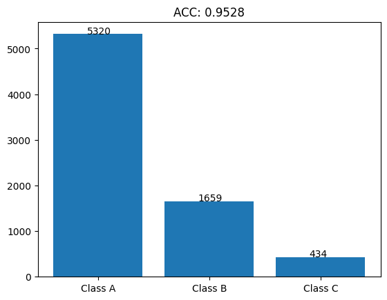

# 深層学習を用いた人間行動識別における確度評価による階層化予測
# 0. 目次
[1.序論](#1-序論)  
[1.1 研究背景](#11-研究背景)  
[1.2 研究概要](#12-研究概要)  
[2.研究手法](#2-研究手法)  
[2.1 データI/O](#21-データio)  
[2.2 モデル](#22-モデル)  
[2.3 評価方法](#23-評価方法)  
[3.結果と考察](#3-結果と考察)  
[3.1 結果](#31-結果)  
[3.2 考察](#32-考察)  
[4.まとめと展望](#4-まとめと展望)  
[4.1 まとめ](#41-まとめ)  
[4.2 展望](#42-展望)  
[5.参考文献](#5-参考文献)  
[6.謝辞](#6-謝辞)  
[7.付録](#7-付録)  
[7.1 使用したコード](#71-使用したコード)  
[7.1.1 実験の再現方法](#711-実験の再現方法)  
[7.2 モデルについて](#72-モデルについて)  
[7.2.1 モデルのハイパーパラメータの決定方法](#721-モデルのハイパーパラメータの決定方法)  


# 1. 序論
## 1.1. 研究背景
深層学習を用いた人間行動識別では、誤検知が重要な問題となっています。誤検知が発生すると、安全保障システムや健康モニタリングなどの分野で深刻な影響を及ぼす可能性があります。たとえば、正常な行動を異常として検知してしまうことが、適切な対応を難しくし、システムの信頼性を低下させます。

単一の予測のみではなく、階層化予測が重要である理由を強調します。階層化予測は、異なる精度や信頼性の予測を段階的に行うことで、誤検知のリスクを軽減し、高い精度での予測を提供します。このアプローチは、システムの信頼性向上に貢献します。

最近の深層学習技術において、Transformerが顕著な存在となっています。その理由や特性に触れ、自然言語処理や画像認識などの分野での成功例を取り上げることが重要です。特に、Transformerの特性が時系列データや人間行動の認識にどのように適用されているかを説明します。

人間行動識別におけるTransformerの応用研究は、その特性と利点を活かし、階層化予測への適用可能性を示すことが重要です。Transformerがどのように行動認識の精度や信頼性向上に寄与するか、実例や成功事例を挙げることで、このテーマの重要性を強調します。

## 1.2. 研究概要
この研究は、深層学習と人間行動識別のベンチマークであるWISDMデータセットを用いて人間の行動を認識し、その予測の確度を評価し、信頼性の高さに応じた階層化予測を行う。

# 2. 研究手法
## 2.1. データI/O
WISDM(Wireless Sensor Data Mining)datasetは2010年に携帯電話を用いて人の行動状態と加速度を取得し、集めたデータセット。

ラベルとして、以下の6つの行動状態と36人分の人間のIDがある。
行動状態、x軸の加速度、y軸の加速度、z軸の加速度、タイムスタンプ、人間のIDがデータベース形式で保存されている。

| Actiity     | Counts  | Percentage |  
|-------------|---------|------------|  
| Walking     | 10611   | 38.6%      |  
| Jogging     |  8552   | 31.2%      |  
| Upstairs    |  3069   | 11.2%      |  
| Downstairs  |  2511   | 9.1%       |  
| Sitting     |  1499   | 5.5%       |  
| Standing    |  1212   | 4.4%       |  
|             |         |            |  
| Total       | 27454   | 100.0%     |  

今回はこの6つの行動状態を目的変数とする。

入力データについて、
データは時系列データであり
サンプリングレートは20Hzである。  
加えて、1データあたり80サンプル存在することから、1データは約4秒である。

つまり、加速度計から取得した4秒間のデータから人間の行動を予測するタスクであると言い換えることができる。

また、加速度データはx,y,zの3軸を持っており、それぞれ以下の画像の軸方向を持つ。


値について、-20m/s^2から20m/s^2の範囲をとる。  
これには重力を含んでいるため、常に鉛直方向に約10m/s^2程度のバイアスが加わる。
しかし、画像の軸のとり方からわかるように常にｙ軸にのみ重力加速度が加わっているわけではない。
つまり、単純にｙ軸の値全てにマイナス10をしても重力加速度は無視できない。


次に、上記の画像から推察できるそれぞれの行動状態についての特徴をまとめる。

まず、「座る」と「立つ」の2種類は他4種類と明らかに異なる。
「座る」「立つ」にはｘｙｚ軸すべてコンスタントな値をとる。
また、「座る」と「立つ」についても「座る」状態ではｚ軸の数値が大きく、「立つ」状態ではｙ軸の数字が大きいという違いがある。
これは前述の重力加速度の影響だろう。

他の4つについては、
「歩く」は1/2秒の周期でピークがあり、ｘ軸は他のｙｚ軸より常に小さい値をとっている。
「走る」は1/4秒の周期でピークが存在し、ｙ軸について負の値が「歩く」より顕著である。
「下り階段」ではｙ軸の加速度が小さく、1/2秒の周期がある。
「上り階段」ではｙｚ軸に3/4秒の周期があり、これは足の進みが他より遅いことを表している。

モデルの訓練データに19217(70%)、検証データに824(3%)、テストデータに7413(27%)のデータを用いた。
訓練データとテストデータに関しては完全にランダムに分割し、
テストデータと検証データに関しては、ラベルの分布が等しくなるように分割した。


## 2.2. モデル
モデルには、Conv. BackBone Transformer を用いています。
Conv. BackBone Transformer は、Convolutional Neural Network (CNN) と Transformer を組み合わせたモデルです。
以下にアーキテクチャを示します。

MSAは、Multi-Head Self-Attentionの略で、TransformerのSelf-Attentionを複数のヘッドで行うことを意味します。
MLPは、Multi-Layer Perceptronの略で、全結合層を複数重ねたものです。
```
MSA = Concat(head_1, head_2, ..., head_n) * W_o

where head_i = SelfAttention(x) * W_i
      SelfAttention(x) = softmax((x * W_q)(x * W_k)^T) * (x * W_v)
```


流れとしては、点単位畳み込み層（活性化関数はGERU）を用いて3チャンネルの入力を25チャンネルに変換しアフィン変換によって80次元を1024次元にエンコードしている。

また、点単位畳み込み層は入力が3次元のFFNを作用させているとも解釈することができる。
その後、CLSトークンを加え、位置エンコーディングとして学習可能な埋め込みを行う。

このあたりの処理は、自然言語用アーキテクチャであるTransformerの処理に最適化させるために行っている。

Transformerとは、自然言語処理の分野で用いられるモデルである。
Transformerの処理を簡単に説明すると、
入力をエンコーダに入れると、エンコーダは入力をエンコードし、CLSトークンを含む出力をMLPで最終加工して返す。

最適化手法はAdam、損失関数は交差エントロピー誤差を用いた。

モデルのバリエーションとして、
Transformer層の数を3，5，7とし3つのモデルを作成した。
これは、アーキテクチャ上のLに該当する。

その他モデル、最適化手法のハイパーパラメータを下表に示す。
| パラメータ         | 値                         |
|--------------------|----------------------------|
| optimizer params   |                            |
| lr                 | 0.0001                     |
| betas              | (0.9, 0.999)               |
| eps                | 1e-08                      |
| weight_decay       | 0                          |
| amsgrad            | False                      |
|                    |                            |
| model params       |                            |
| hidden_ch          | 25                         |
| hidden_dim         | 1024                       |
| heads              | 8                          |
| mlp_dim            | 1024                       |
| dropout            | 0.01                       |
| emb_dropout        | 0.01                       |


## 2.3. 評価方法
- ACC(Accuracy)：正答率
- RCL(Recall)：再現性（見落率）
- PRC(Precision)：特異性（的中率）
- F1-Score：RCLとPRCの調和平均

# 3. 結果と考察
## 3.1. 結果
まず、それぞれのモデルの出力結果を示す。

クラスA、クラスB、クラスCの三段階の階層化予測を行った。

- クラスAの予測
各モデルが99%の精度を担保できる閾値でテストデータに対して予測を行った。
検証データから得られた99%の精度が得られる閾値を元に決定した。
全テストデータ7413個に対し、5320個のデータが99.6%の精度で正しく予測された。
これは、全体の72%に相当する。


- クラスBの予測
クラスAで予測されなかったデータについてモデル間で多数決を行い、全一致したデータを予測とした。
全テストデータ7413個に対し、1659個のデータが95.0%の精度で正しく予測された。

- クラスCの予測
クラスA、クラスBで予測されなかったデータについて最もパラメータ数の多いモデルで予測を行った。
全テストデータ7413個に対し、434個のデータが43.8%の精度で正しく予測された。


合計の精度は、95.28%である。

|       | ACC   | RCL   | PRC   |F1-Score|
|-------|-------|-------|-------|--------|
|クラスA| 99.5% | 98.6% | 99.0% | 98.8%  |
|クラスB| 95.0% | 94.3% | 95.2% | 94.7%  |
|クラスC| 43.8% | 40.2% | 36.5% | 36.8%  |
|合計   | 95.3% | 93.2% | 93.8% | 93.4%  |




## 3.2. 考察
実験結果に基づいて、著者自身の解釈、洞察、説明が提供されます。
他論文との比較を行う。
他論文で提唱されているのはあくまで全体の精度であり、階層化予測の精度については言及されていない。

全体の精度としてSOTAは、9%である。

# 4. まとめと展望
## 4.1. まとめ


## 4.2. 展望
改善点として、
- 多数決アルゴリズムはモデルの数に応じて精度工場が見込めるためモデルの数を増やす
- クラスCの予測については、さらに細分化したクラスを作成し精度向上の上澄みを取る
- 最終どうしようもないクラスCの処理については、特化したモデルを作成する

# 5. 参考文献
CNNのKaggle：https://www.kaggle.com/code/paulopinheiro/human-activity-recognition-1d-cnn
CNNの論文：https://arxiv.org/pdf/1809.08113.pdf
ViT：https://arxiv.org/pdf/2010.11929.pdf
元データの論文：https://www.cis.fordham.edu/wisdm/public_files/sensorKDD-2010.pdf
元Convbbt：https://ieeexplore.ieee.org/document/9393889
Conformer：https://www.mdpi.com/1424-8220/22/10/3932
ConvBB-BiLSTM：https://qiita.com/NakagawaRen/items/b3f7727e9528866c371f


# 6. 謝辞
今回の研究を進めるにあたり、懇切丁寧にご指導を頂いた鳥取大学工学部機械物理系学科の計算理工学研究室小谷岳生教授、同研究室の藤井一輝さんに深く感謝致します。

# 7. 付録
## 7.1. 使用したコード
今回使用したコードは、以下のリポジトリにて公開しています。
コードはすべてPythonで、深層学習用ライブラリであるPytorchを用いて実装を行った。
https://github.com/rakawanegan/humanactivityrecognition_portfolio

## 7.1.1 実験の再現方法
実験結果はすべて、`result`ディレクトリに保存されています。
また、実験に必要なコードについても同階層の`raw`ディレクトリに保存されています。

追加で変更を行い、実験を希望する場合には`run.py`を実行してください。
初回実行時に限り以下のリンクよりデータをダウンロードすることに留意してください。
https://www.cis.fordham.edu/wisdm/includes/datasets/latest/WISDM_ar_latest.tar.gz


実行時には、`--path`オプションに実験したいモデル名を指定してください。
参照先は`main`ディレクトリとなっています。
用意しているモデルについては、以下の通りです。
- convbbt: Conv. BackBone Transformer ※デフォルト
- cnn1d: Convolutional Neural Network
- vit1d: Vision Transformer
- transposition_convbbt: 入力データの転置を行ったConv. BackBone Transformer
- optuna_convbbt: Optunaを用いたハイパラ最適化を行うConv. BackBone Transformer
- optuna_vit1d: Optunaを用いたハイパラ最適化を行うVision Transformer
- optuna_convtransformer: 軽量化したConv. BackBone Transformer

以下に使用例を示します。

```bash
$ python run.py --path convbbt --git push
```

また、デフォルトではオフにしていますが、リモート先を変更した上で実行している場合に限り--gitオプションにpushを渡すことによって実験結果を即リモートにpushすることができます。
これによってリモートのGitHubのpush時の通知を有効にしている場合、実験結果が通知されます。
Optunaを用いた実験を行う場合には非常に長い時間の実験となるため、このオプションを有効にすることを推奨します。

## 7.2. モデルについて
今回実験にあたり、Conv. BackBone Transformer を用いています。
しかし、他にもいくつかのモデルを用いて実験を行いました。
以下にそのモデルについて説明します。
- CNN
- Vision Transformer

いずれも、Conv. BackBone Transformer と比較をすると確度評価による階層化予測の精度が低下することがわかりました。

理由として、
- CNNは確度分布が一様であるため、多数決アルゴリズムによる階層化予測が困難であること。
- ViTはモデル自体の精度が低いこと。

が挙げられます。

## 7.2.1 モデルのハイパーパラメータの決定方法
モデルのハイパーパラメータの決定には、Optunaを用いています。
Optunaとは、ベイズ推定を用いたハイパーパラメータの最適化を行うPythonライブラリです。
Optunaを用いることで、グリッドサーチやランダムサーチよりも効率的にハイパーパラメータの最適化を行うことができます。
探索空間を定義し、目的関数を定義することで、ハイパーパラメータの最適化を行うことができます。
時間または回数を指定して探索を行うことができます。
