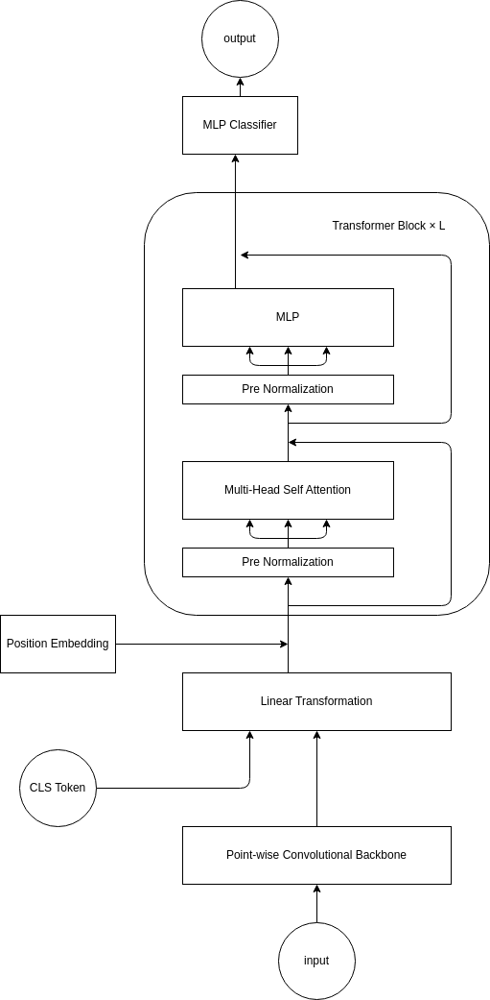

# 深層学習を用いた人間行動識別における確度評価による階層化予測
# 0. 目次
[1.序論](#1-序論)  

# 1. 序論
## 1.1. 研究背景

深層学習は、画像や動画などの膨大なデータから特徴を抽出し、人間の行動を高い精度で認識できる技術です。これは、監視システムの改善、健康モニタリング、スマートシティの構築など様々な分野で利用されています。

犯罪予防やセキュリティ強化において、異常な行動をリアルタイムで検知することは非常に重要です。深層学習を活用した人間行動識別は、異常な行動や危険な状況を検知し、即座に対処する手段として非常に有用です。

また、健康モニタリングにおいても、個人の日常行動パターンを認識することで、病気や異常な状態の早期発見や予防につながる可能性があります。例えば、高齢者や病気の人々のケアに役立ちます。

このような利用範囲の広がりと、社会的・個人的な価値が深層学習による人間行動識別の研究を重要なものにしています。その一方で、精度や確度の面での課題や、モデルの信頼性の向上が必要な点も挙げられます。

研究の目的は、これらの課題に焦点を当て、深層学習を用いた人間行動識別の精度向上や確度評価による階層化予測の手法開発に貢献することであり、その重要性が強調されます。

## 1.2. 研究概要

この研究は、深層学習と人間行動識別のベンチマークであるWISDMデータセットを用いて人間の行動を認識し、その予測の確度を評価し、信頼性の高い階層化予測を行うことを目的としています。

# 2. 研究手法
## 2.1. データI/O

WISDM(Wireless Sensor Data Mining)datasetは2010年に携帯電話を用いて人の行動状態と加速度を取得し、集めたデータセット。

ラベルとして、以下の6つの行動状態と36人分の人間のIDがある。

| Actiity     | Counts  | Percentage |  
|-------------|---------|------------|  
| Walking     | 424,400 | 38.6%      |  
| Jogging     | 342,177 | 31.2%      |  
| Upstairs    | 122,869 | 11.2%      |  
| Downstairs  | 100,427 | 9.1%       |  
| Sitting     | 59,939  | 5.5%       |  
| Standing    | 48,395  | 4.4%       |  
|             |         |            |  
| Total       |1,098,207| 100.0%     |  

今回はこの6つの行動状態を目的変数とする。

入力データについて、
データは時系列データであり
サンプリングレートは20Hzである。  
加えて、1データあたり80サンプル存在することから、1データは約4(80/20)秒である。

つまり、加速度計から取得した4秒間のデータから人間の行動を予測するタスクであると言い換えることができる。

また、加速度データはx,y,zの3軸を持っており、それぞれ以下の画像の軸方向を持つ。


値について、-20m/s^2から20m/s^2の範囲をとる。  
これには重力を含んでいるため、常に鉛直方向に約10m/s^2程度のバイアスが加わる。
しかし、画像の軸のとり方からわかるように常にｙ軸にのみ重力加速度が加わっているわけではない。
つまり、単純にｙ軸の値全てにマイナス10をしても重力加速度は無視できない。


次に、上記の画像から推察できるそれぞれの行動状態についての特徴をまとめる。

まず、「座る」と「立つ」の2種類は他4種類と明らかに異なる。
「座る」「立つ」にはｘｙｚ軸すべてコンスタントな値をとる。
また、「座る」と「立つ」についても「座る」状態ではｚ軸の数値が大きく、「立つ」状態ではｙ軸の数字が大きいという違いがある。
これは前述の重力加速度の影響だろう。

他の4つについては、
「歩く」は1/2秒の周期でピークがあり、ｘ軸は他のｙｚ軸より常に小さい値をとっている。
「走る」は1/4秒の周期でピークが存在し、ｙ軸について負の値が「歩く」より顕著である。
「下り階段」ではｙ軸の加速度が小さく、1/2秒の周期がある。
「上り階段」ではｙｚ軸に3/4秒の周期があり、これは足の進みが他より遅いことを表している。


## 2.2. モデル
モデルには、Conv. BackBone Transformer を用いています。
Conv. BackBone Transformer は、Convolutional Neural Network (CNN) と Transformer を組み合わせたモデルです。
以下にアーキテクチャを示します。


流れとしては、Transformerの処理に最適化させるために点単位畳み込み層（活性化関数はGERU）を用いて3チャンネルの入力を25チャンネルに変換しアフィン変換によって80次元を1024次元にエンコードしている。

また、点単位畳み込み層は入力が3次元のFFNを作用させているとも解釈することができる。
その後、CLSトークンを加え、位置エンコーディングとして学習可能な埋め込みを行う。

最適化手法はAdam、損失関数は交差エントロピー誤差を用いた。

モデルのバリエーションとして、
Transformer層の数を3，5，7とし3つのモデルを作成した。


## 2.3. 評価方法
- ACC(Accuracy)：正答率
- RCL(Recall)：再現性（見落率）
- PRC(Precision)：特異性（的中率）
- F1-Score：RCLとPRCの調和平均

# 3. 結果と考察
まず、それぞれのモデルの出力結果を示す。

# 4. まとめと展望
## 4.1. まとめ
## 4.2. 展望

# 5. 参考文献

# 6. 謝辞
今回の研究を進めるにあたり、懇切丁寧にご指導を頂いた鳥取大学工学部機械物理系学科の計算理工学研究室小谷岳生教授、同研究室の藤井一輝さんに深く感謝致します。

# 7. 付録
## 7.1. 使用したコード
今回使用したコードは、以下のリポジトリにて公開しています。
コードはすべてPythonで、深層学習用ライブラリであるPytorchを用いて実装を行った。
https://github.com/rakawanegan/humanactivityrecognition_portfolio

## 7.1.1 実験の再現方法

実験結果はすべて、`result`ディレクトリに保存されています。
また、実験に必要なコードについても同階層の`raw`ディレクトリに保存されています。

追加で変更を行い、実験を希望する場合には`run.py`を実行してください。
初回実行時に限り以下のリンクよりデータをダウンロードすることに留意してください。
https://www.cis.fordham.edu/wisdm/includes/datasets/latest/WISDM_ar_latest.tar.gz


実行時には、`--path`オプションに実験したいモデル名を指定してください。
参照先は`main`ディレクトリとなっています。
以下に使用例を示します。

```bash
$ python run.py --path convbbt --git push
```

また、デフォルトではオフにしていますが、リモート先を変更した上で実行している場合に限り--gitオプションにpushを渡すことによって実験結果を即リモートにpushすることができます。
これによってリモートのGitHubのpush時の通知を有効にしている場合、実験結果が通知されます。
Optunaを用いた実験を行う場合には非常に長い時間の実験となるため、このオプションを有効にすることを推奨します。

## 7.2. モデルについて
## 7.2.1 モデルのハイパーパラメータの決定方法

モデルのハイパーパラメータの決定には、Optunaを用いています。
Optunaとは、ベイズ推定を用いたハイパーパラメータの最適化を行うPythonライブラリです。
Optunaを用いることで、グリッドサーチやランダムサーチよりも効率的にハイパーパラメータの最適化を行うことができます。
探索空間を定義し、目的関数を定義することで、ハイパーパラメータの最適化を行うことができます。
時間または回数を指定して探索を行うことができます。
