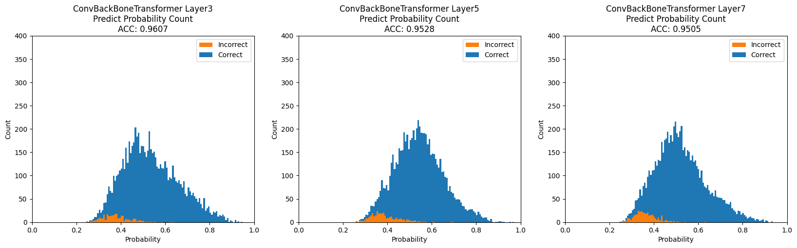
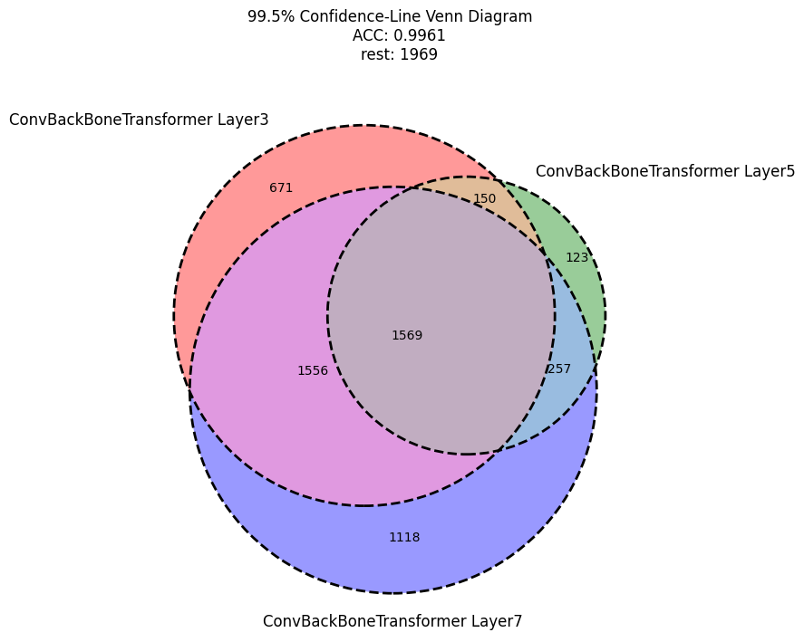
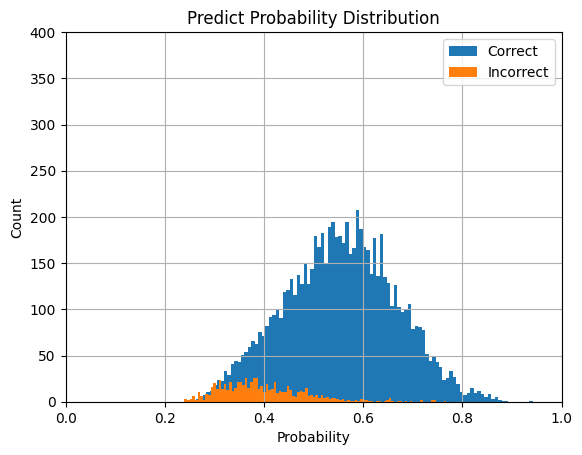

# 2024年度 卒業論文
# 深層学習を用いた人間行動識別における確度評価による階層化予測

鳥取大学工学部機械物理系学科  
物理工学コース  
B20T1070Y  
指導教員 小谷岳生 教授


<div style="page-break-before:always"></div>
<!-- TeX形式で入力できるように設定 -->
<script type="text/javascript" async src="https://cdnjs.cloudflare.com/ajax/libs/mathjax/2.7.7/MathJax.js?config=TeX-MML-AM_CHTML">
</script>
<script type="text/x-mathjax-config">
 MathJax.Hub.Config({
 tex2jax: {
 inlineMath: [['$', '$'] ],
 displayMath: [ ['$$','$$'], ["\\[","\\]"] ]
 }
 });
</script>

# 0. 目次
[1.緒言](#1-緒言)  
[1.1 研究背景](#11-研究背景)  
[1.2 研究概要](#12-研究概要)  
[2.研究手法](#2-研究手法)  
[2.1 データI/O](#21-データio)  
[2.2 モデル](#22-モデル)  
[2.3 確度の算出方法](#23-確度の算出方法)
[2.4 評価方法](#24-評価方法)  
[3.結果と考察](#3-結果と考察)  
[3.1 結果](#31-結果)  
[3.2 考察](#32-考察)  
[4.結言](#4-結言)  
[4.1 まとめ](#41-まとめ)  
[4.2 展望](#42-展望)  
[5.参考文献](#5-参考文献)  
[6.謝辞](#6-謝辞)  
[7.付録](#7-付録)  
[7.1 使用したコード](#71-使用したコード)  
[7.1.1 実験の再現方法](#711-実験の再現方法)  
[7.2 モデルについて](#72-モデルについて)  
[7.2.1 モデルのハイパーパラメータの決定方法](#721-モデルのハイパーパラメータの決定方法)  
<div style="page-break-before:always"></div>

# 1. 緒言
## 1.1. 研究背景
深層学習を用いた人間行動識別では、誤検知が重要な問題となっている。誤検知が発生すると、安全保障システムや健康モニタリングなどの分野で深刻な影響を及ぼす可能性がある。
たとえば、正常な行動を異常として検知してしまうことが、適切な対応を難しくしシステムの信頼性を低下させる。

単一の予測のみではなく、階層化予測が重要である理由を強調する。階層化予測は、異なる精度や信頼性の予測を段階的に行うことで、誤検知のリスクを軽減し高い精度での予測を行う。
このアプローチは、システムの信頼性向上に貢献する。

人間行動識別におけるTransformerの応用研究として、その特性と利点を活かし、階層化予測への適用可能性を示す。
Transformerがどのように行動認識の精度や信頼性向上に寄与するか、実例を提供する。

## 1.2. 研究概要
本研究は、深層学習と人間行動識別のベンチマークであるWISDMデータセットを用いて人間の行動を認識し、その予測の確度を評価し信頼性の高さに応じた階層化予測を行うことで部分的ではあるが99.6%という非常に高精度な予測を行うことができた。
<div style="page-break-before:always"></div>

# 2. 研究手法
## 2.1. データI/O
WISDM(Wireless Sensor Data Mining)datasetは2010年に携帯電話を用いて人の行動状態と加速度を取得し、集めたデータセットである。[2](#5-参考文献)

行動状態、x軸の加速度、y軸の加速度、z軸の加速度、タイムスタンプ、人間のIDがデータベース形式で保存されている。
ラベルとして、以下の6つの行動状態がある。

| Actiity     | Counts  | Percentage |
|-------------|---------|------------|
| Walking     | 10611   | 38.6%      |
| Jogging     |  8552   | 31.2%      |
| Upstairs    |  3069   | 11.2%      |
| Downstairs  |  2511   | 9.1%       |
| Sitting     |  1499   | 5.5%       |
| Standing    |  1212   | 4.4%       |
|             |         |            |
| Total       | 27454   | 100.0%     |

今回はこの6つの行動状態を目的変数とする。

入力データについて、データは時系列データであり、サンプリングレートは20Hzである。
また、1データあたり80サンプル存在することから、1データは約4秒である。
つまり、加速度計から取得した4秒間のデータから人間の行動を予測するタスクであると言い換えることができる。

また、加速度データはx,y,zの3軸を持っており、それぞれ以下の画像の軸方向を持つ。


[2](#5-参考文献)-Figure 1: Axes of Motion Relative to Userから引用

値について、-20m/s^2から20m/s^2の範囲をとる。  
これには重力を含んでいるため、常に鉛直方向に約10m/s^2程度のバイアスが加わる。
しかし、画像の軸のとり方からわかるように常にｙ軸にのみ重力加速度が加わっているわけではない。
つまり、単純にｙ軸の値全てにマイナス10をしても重力加速度は無視できない。

  

[2](#5-参考文献)-Figure 2: Acceleration Plots for the Six Activities (a-f)から引用

<div style="page-break-before:always"></div>
次に、上記の画像から推察できるそれぞれの行動状態についての特徴をまとめる。

まず、「座る」と「立つ」の2種類は他4種類と明らかに異なる。
「座る」「立つ」にはｘｙｚ軸すべてコンスタントな値をとる。
また、「座る」と「立つ」についても「座る」状態ではｚ軸の数値が大きく、「立つ」状態ではｙ軸の数字が大きいという違いがある。
これは前述の重力加速度の影響だろう。

他の4つについては、
「歩く」は1/2秒の周期でピークがあり、ｘ軸は他のｙｚ軸より常に小さい値をとっている。
「走る」は1/4秒の周期でピークが存在し、ｙ軸について負の値が「歩く」より顕著である。
「下り階段」ではｙ軸の加速度が小さく、1/2秒の周期がある。
「上り階段」ではｙｚ軸に3/4秒の周期があり、これは足の進みが他より遅いことを表している。

モデルの訓練データに19217(70%)、検証データに824(3%)、テストデータに7413(27%)のデータを用いた。
訓練データとテストデータに関しては完全にランダムに分割し、
テストデータと検証データに関しては、ラベルの分布が等しくなるように分割した。
<div style="page-break-before:always"></div>


## 2.2. モデル
モデルには、Conv. BackBone Transformer を用いた。
Conv. BackBone Transformer は、Convolutional Neural Network (CNN) と Transformer を組み合わせたモデルである。
以下にアーキテクチャを示す。
<div style="page-break-before:always"></div>


<div style="page-break-before:always"></div>
各ブロックの説明は以下の通り。

Position Embeddingは、位置エンコーディングのことで、入力データの位置情報を学習可能な埋め込みに変換する。  
PreNormalizationは、入力データに対して正規化を行う。  
MSAは、Multi-Head Self-Attentionの略で、TransformerのSelf-Attentionを複数のヘッドで行う。  
MLPは、Multi-Layer Perceptronの略で、全結合層を複数重ねたものである。  
Transformerブロックでは、すべての変換に残差接続と正規化を行う。  
これは、Transformerのアーキテクチャに従っており、学習の安定化に寄与する。  

<div style="page-break-before:always"></div>
以下に処理の定式化を行う。

```math
# PointwiseConv1d
loop four times
    x_i = GERU(Conv1d_Layer(x_i))

# Liner transformation
x_i = E * x_i

# Position Embedding
x_i = x_i + E_pos
x = Concat(cls, x_1, x_2, ..., x_n)


# Transformer
loop L times
    x = MSA(PreNormalization(x)) + x
    x = MLP(PreNormalization(x)) + x

# output
y = MLP(cls)

where
      E = R^80*1024
      E_pos = R^1024
      MSA = Concat(head_1, head_2, ..., head_n) * W_o
      head_i = SelfAttention(x) * W_i
      SelfAttention(x) = softmax((x * W_q)(x * W_k)^T) * (x * W_v)
      softmax(x) = exp(x) / sum(exp(x))
```

まずConvolutional Neural Network (CNN) によって入力データの前処理を行う。
点単位畳み込み層（活性化関数：GERU）を用いて3チャンネルの入力を25チャンネルに変換し線形変換によって80次元を1024次元にエンコードする。
この処理によって、入力データの特徴を抽出し、次元を増やす。

次に、多クラス分類を行うため、入力データにCLSトークンを加え、位置エンコーディングとして学習可能な埋め込みを行う。

次にTransformer層に入力を行う。
Transformerとは、自然言語処理の分野で用いられるモデルである。
Transformerの処理を簡単に説明すると、
入力をエンコーダに入れると、エンコーダは入力をエンコードし、CLSトークンを含む出力をMLPで最終加工して予測ラベルを返す。

また、最適化手法はAdam、損失関数は交差エントロピー誤差を用いた。

モデルのバリエーションとして、
Transformer層の数 L を3，5，7とし3つのモデルを作成した。
<div style="page-break-before:always"></div>

## 2.3. 確度の算出方法
モデルの予測結果の確度を算出する。
確度の計算方法は以下の条件を満たす変換を行った。

- 0以上1以下の値をとる
- 総和が1である

深層学習において、出力結果にソフトマックス関数を適用することで、上記の条件を満たす変換を行うことができる。
しかし、ソフトマックス関数は指数関数の性質上、値が大きくなると急激に増加する。
そのため、極端な値をとることがあり、確度の算出に適さない。

そこで、今回はMin-Max Scalingを行い、その後総和で割ることで確度を算出した。

以下に定式化を行う。
```math
# Min-Max Scaling
x = (x - min(x)) / (max(x) - min(x))

# Probability
x = x / sum(x)
```

## 2.4. 評価方法
以下の指標を用いて、モデルの評価を行った。

- ACC(Accuracy)：正答率
- RCL(Recall)：再現性（見落率）
- PRC(Precision)：特異性（的中率）
- F1-Score：RCLとPRCの調和平均

これらの指標は、以下の式で定義される。

```math
ACC = (TP + TN) / (TP + TN + FP + FN)
RCL = TP / (TP + FN)
PRC = TP / (TP + FP)
F1-Score = 2 * PRC * RCL / (PRC + RCL)
```

ACCは、正答率であり、正しく予測できたデータの割合を示す。
RCLは、再現性であり、正しく予測できたデータのうち、正解データの割合を示す。
PRCは、特異性であり、正しく予測できたデータのうち、予測データの割合を示す。
F1-Scoreは、RCLとPRCの調和平均であり、RCLとPRCのバランスを示す。

<div style="page-break-before:always"></div>


# 3. 結果と考察
## 3.1. 結果
まず、それぞれのモデルのテストデータの予測結果の確度分布を示す。



確度の小さい部分に誤検知が多く存在していることがわかる。


<div style="page-break-before:always"></div>

検証データを用いて閾値を決定し、クラスA-Fの六段階の階層化予測を行った。

| CLASS | THRESHOLD |   ACC    |   RCL    |   PRC    |    F1    |  SIZE  |
|-------|-----------|----------|----------|----------|----------|--------|
|Class-A|   99.5%   | 99.614%  | 98.829%  | 99.050%  | 98.939%  |  5444  |
|Class-B|   99%     | 93.792%  | 92.964%  | 93.247%  | 93.074%  |  1192  |
|Class-C|   98%     | 79.966%  | 83.096%  | 81.296%  | 81.992%  |   594  |
|Class-D|   97%     | 67.407%  | 44.649%  | 40.734%  | 42.301%  |   135  |
|Class-E|   96%     | 47.368%  | 35.552%  | 34.508%  | 33.801%  |    38  |
|Class-F|   Rest    | 30.000%  | 34.000%  | 21.667%  | 22.381%  |    10  |
|  ---  |   Total   | 96.155%  | 94.432%  | 95.076%  | 94.735%  |  7413  |


- クラスAの予測
全データのうち、5444個がクラスAである。
これは、全体の73.4%である。
クラスAの予測については、99.6%の精度で予測できている。

- クラスBの予測
全データのうち、1192個がクラスBである。
これは、全体の16.1%である。
クラスBの予測については、93.2%の精度で予測できている。

- クラスCの予測
全データのうち、594個がクラスCである。
これは、全体の8.0%である。
クラスCの予測については、80.0%の精度で予測できている。

- クラスDの予測
全データのうち、135個がクラスDである。
これは、全体の1.8%である。
クラスDの予測については、47.4%の精度で予測できている。

- クラスEの予測
全データのうち、38個がクラスEである。
これは、全体の0.5%である。
クラスEの予測については、34.5%の精度で予測できている。

- クラスFの予測
全データのうち、10個がクラスFである。
これは、全体の0.1%である。
クラスFの予測については、30.0%の精度で予測できている。

- 全体の予測
全体の予測については、96.2%の精度で予測できている。


クラスAの予測について各モデルの予測したインデックスのベン図を以下に示す。
重複を見ると、3つのモデルが重複しているものは1569個である。
また、3，5，7層のモデルのみで予測しているものはそれぞれ671，123，1118個である。


<div style="page-break-before:always"></div>


## 3.2. 考察
他論文との比較を行う。
すくなくとも人間行動識別の分野において他論文で提唱されているのはあくまで全体の精度であり、階層化予測の精度については言及されていない。

WISDMデータセットにおいて、SOTAは、97.31%%である。
これは、CNNとBiLSTMを組み合わせたモデルである。[4](#5-参考文献)
また、Transformerの適用事例として最大の精度を誇るConformerは、96%であった。[5](#5-参考文献)
これは、Transformer層に畳み込み層を入れることで、CNNとTransformerを組み合わせた音声認識の分野からの応用モデルである。

いずれも、本研究の96.16%を上回る精度である。
しかし、階層化予測を行うことによってクラスAの予測については99.6%の精度で予測できている。
これは、SOTAを上回る精度である。

誤検知を軽減することは、人間行動識別の分野において重要である。
なぜなら、人間を監視するシステムや健康モニタリングなどの分野で誤検知が発生すると、安全保障システムや健康モニタリングなどの分野で深刻な影響を及ぼす可能性があるからである。
したがって、実運用を考えた場合に予測を階層化することで、誤検知を軽減し高い精度での予測を行うことができることは重要である。
<div style="page-break-before:always"></div>

# 4. 結言
## 4.1. まとめ
今回の研究では、人間行動識別における確度評価による階層化予測を行った。
その結果、全体の精度は96.16%であった。
これ自体については、SOTAには及ばないが、
階層化予測によって、クラスAの予測については99.6%の精度で予測できている。
これは、SOTAを上回る精度である。

## 4.2. 展望
改善点として、分割の閾値を変更し、より多くのデータ群に対しSOTAを上回る精度を出すことができるか検証することが挙げられる。


# 5. 参考文献
[1]AN IMAGE IS WORTH 16X16 WORDS: TRANSFORMERS FOR IMAGE RECOGNITION AT SCALE
[2]Activity Recognition using Cell Phone Accelerometers 
[3]Boosting Inertial-Based Human Activity Recognition With Transformers
[4]Inertial-Measurement-Unit-Based Novel Human Activity Recognition Algorithm Using Conformer
[5]Human Activity Recognition Based on Residual Network and BiLSTM
[6]Human activity recognition based on time series analysis using U-Net 
[7]https://www.kaggle.com/code/paulopinheiro/human-activity-recognition-1d-cnn (2023/11/16閲覧)


# 6. 謝辞
研究を進めるにあたり、懇切丁寧にご指導を頂いた鳥取大学工学部機械物理系学科の計算理工学研究室小谷岳生教授、同研究室の藤井一輝さんに深く感謝致します。
<div style="page-break-before:always"></div>


# 7. 付録
## 7.1. 使用したコード
今回使用したコードは、以下のリポジトリにて公開している。
コードはすべてPythonで、深層学習用ライブラリであるPytorchを用いて実装を行った。
https://github.com/rakawanegan/humanactivityrecognition_portfolio

## 7.1.1 実験の再現方法
実験結果はすべて、`result`ディレクトリに保存されている。
また、実験に必要なコードについても同階層の`raw`ディレクトリに保存されている。

追加で変更を行い、実験を希望する場合には`run.py`を実行すること。
初回実行時に限り以下のリンクよりデータをダウンロードすることに留意。
https://www.cis.fordham.edu/wisdm/includes/datasets/latest/WISDM_ar_latest.tar.gz

実行時には、`--path`オプションに実験したいモデル名を指定する。
参照先は`main`ディレクトリ。
用意しているモデルについては、以下の通り。
モデル | 説明
-------|--------
convbbt| Conv. BackBone Transformer ※デフォルト
cnn1d  | Convolutional Neural Network
vit1d  | Vision Transformer
transposition_convbbt | 入力データの転置を行ったConv. BackBone Transformer
optuna_convbbt        | Optunaを用いたハイパラ最適化を行うConv. BackBone Transformer
optuna_vit1d          | Optunaを用いたハイパラ最適化を行うVision Transformer
optuna_convtransformer| 軽量化したConv. BackBone Transformer


以下に使用例を示す。

```bash
$ python run.py --path convbbt --git push
```

また、デフォルトではオフにしているが、リモート先を変更した上で実行している場合に限り--gitオプションにpushを渡すことによって実験結果を即リモートにpushすることができる。
これにより、リモートのGitHubのpush時の通知を有効にしている場合、実験結果が通知される。
Optunaを用いた実験を行う場合には非常に長い時間の実験となるため、このオプションを有効にすることを推奨する。
<div style="page-break-before:always"></div>

## 7.2. モデルについて
本研究では、Conv. BackBone Transformer を用いている。

しかし、他にもいくつかのモデルを用いて実験を行った。
以下にそのモデルについて説明する。
- CNN[6]
- Vision Transformer

いずれも、Conv. BackBone Transformer と比較をすると確度評価による階層化予測の精度が低下する。

理由として、
- CNNは確度分布が一様であるため、多数決アルゴリズムによる階層化予測が困難であること。
- ViTはモデル自体の精度が低いこと。

が挙げられる。

また、他モデルと比較したTransformerの優位性として、スケーラビリティが挙げられる。
Transformerでは、Transformer層を重ねることでモデルの表現力を調整することができる。
CNNやRNNでは、モデルの表現力を調整するためには、モデルの構造を変更する必要がある。
前述の方法により、Transformerはモデルの構造を変更することなく、モデルの表現力を調整することができる。

CNNのモデルについて、以下に確度の分布を示す。
急激に確度が低下していることがわかる。
また、誤りの分布が一様になっておりうまく階層化予測ができないことがわかる。


ViTのモデルについて、以下に確度の分布を示す。
確度の分布はなだらかで、確度が低い部分に誤りが多く存在していることがわかる。



<div style="page-break-before:always"></div>

## 7.2.1 モデルのハイパーパラメータの決定方法
モデルのハイパーパラメータの決定には、Optunaを用いた。
Optunaとは、ベイズ推定を用いたハイパーパラメータの最適化を行うPythonライブラリ。
Optunaを用いることで、グリッドサーチやランダムサーチよりも効率的にハイパーパラメータの最適化を行うことができる。
探索空間を定義し、目的関数を定義することで、ハイパーパラメータの最適化を行うことができる。
時間または回数を指定して探索を行うことができる。

Conv. BackBone Transformer について探索結果を以下に示す。
| パラメータ         | 値                         |
|--------------------|----------------------------|
| optimizer params   |                            |
| lr                 | 0.0001                     |
| betas              | (0.9, 0.999)               |
| eps                | 1e-08                      |
| weight_decay       | 0                          |
| amsgrad            | False                      |
|                    |                            |
| model params       |                            |
| hidden_ch          | 25                         |
| hidden_dim         | 1024                       |
| heads              | 8                          |
| mlp_dim            | 1024                       |
| dropout            | 0.01                       |
| emb_dropout        | 0.01                       |